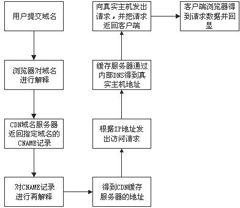

# CDN技术原理

要了解CDN的实现原理，首先让我们来回顾一下网站传统的访问过程，以便理解其与CDN访问方式之间的差别： 

由上图可见，传统的网站访问过程为: 1. 用户在浏览器中输入要访问的域名； 2. 浏览器向域名解析服务器发出解析请求，获得此域名对应的IP地址； 3. 浏览器利用所得到的IP地址，向该IP对应的服务器发出访问请求； 4. 服务器对此响应，将数据回传至用户浏览器端显示出来。 与传统访问方式不同，CDN网络则是在用户和服务器之间增加Cache层，将用户的访问请求引导到Cache节点而不是服务器源站点，要实现这一目的，主要是通过接管DNS实现，下图为使用CDN缓存后的网站访问过程： 

由上图可见，使用CDN缓存后的网站访问过程演变为： 1. 用户在浏览器中输入要访问的域名； 2. 浏览器向域名解析服务器发出解析请求，由于CDN对域名解析过程进行了调整，所以用户端一般得到的是该域名对应的CNAME记录，此时浏览器需要再次对获得的CNAME域名进行解析才能得到缓存服务器实际的IP地址。 注：在此过程中，全局负载均衡DNS解析服务器会根据用户端的源IP地址，如地理位置（深圳还是上海）、接入网类型（电信还是网通）将用户的访问请求定位到离用户路由最短、位置最近、负载最轻的Cache节点（缓存服务器）上，实现就近定位。定位优先原则可按位置、可按路由、也可按负载等。 3. 再次解析后浏览器得到该域名CDN缓存服务器的实际IP地址，向缓存服务器发出访问请求； 4. 缓存服务器根据浏览器提供的域名，通过Cache内部专用DNS解析得到此域名源服务器的真实IP地址，再由缓存服务器向此真实IP地址提交访问请求； 5. 缓存服务器从真实IP地址得到内容后，一方面在本地进行保存，以备以后使用，同时把得到的数据发送到客户端浏览器，完成访问的响应过程； 6. 用户端得到由缓存服务器传回的数据后显示出来，至此完成整个域名访问过程。

通过以上分析可以看到，不论是否使用CDN网络，普通用户客户端设置不需做任何改变，直接使用被加速网站原有域名访问即可。对于要加速的网站，只需修改整个访问过程中的域名解析部分，便能实现透明的网络加速服务。

# 购买CDN后解析操作步骤

要加入CDN服务的网站，需要域名解析权提供给CDN运营商，然后把域名解析记录的A记录改为CNAME并指向cache.cdn.com即可
