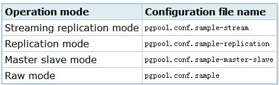

# PostgreSQL+pgpool-II复制方案

\[TOC\]

## 1\. Pgpool-II介绍

pgpool-II是PostgreSQL服务器之间一种有效的中间件和PostgreSQL数据库客户端。它提供了以下功能。

**连接池** pgpool-II保存到PostgreSQL服务器的连接，当一个相同新连接(如用户名、数据库、协议版本)进来时，重用他们。它减少了连接开销，提高了系统的整体吞吐量。 **复制** pgpool-II可以管理多个PostgreSQL服务器。使用复制功能可以使2个或更多的物理磁盘上创建一个实时备份，这样服务不会因服务器的磁盘故障而中断。 **负载平衡** 如果数据库是复制的，在任何服务器上执行一个SELECT查询会返回相同的结果。pgpool-II复制特性的优势在于减少每个PostgreSQL服务器上的负载，因为它可以使用分布在多个服务器之间进行SELECT查询，从而提高系统的整体吞吐量。最好是查询和PostgreSQL服务器数量成一定比例，多用户同时执行多查询达到负载均衡最好的效果。 **限制连接数** PostgreSQL的最大并发连接数有一定限制的，当超过限制的连接数后，连接会被拒绝。然而，设置增加最大连接数又会增加资源消耗，影响系统性能。pgpool-II也有最大连接数限制，但超过的连接进来时是进行立即排队，而不是返回一个错误。

pgpool-II交互PostgreSQL的后端和前端协议时，起着继电器的作用。因此，数据库应用程序(前端)认为pgpool-II是真实的PostgreSQL服务器，服务器(后端)认为pgpool-II是它的客户端之一。因为pgpool-II在服务器和客户端是透明的，所以pgpool-II可以使用现有的数据库应用程序而做到几乎不修改它们。

环境： CentOS6.8 PostgreSQL9.5 pgpool-II-pg95-3.6.1

## 2\. pgpool-II安装

### 1.1 安装pgpool-II yum源

```
rpm -ivh http://www.pgpool.net/yum/rpms/3.6/redhat/rhel-6-x86_64/pgpool-II-release-3.6-1.noarch.rpm
yum -y install pgpool-II-pg95
yum -y install pgpool-II-pg95-debuginfo
yum -y install pgpool-II-pg95-devel
yum -y install pgpool-II-pg95-extensions
```

```
chkconfig pgpool on    # 添加开机启动
service start/stop pgpool   # 服务启/停
```

### 1.2 添加Pgpool-II运行用户

```
[root@im110 pgpool-II]# useradd pgpool                                                      
[root@im110 pgpool-II]# passwd pgpool
Changing password for user pgpool.
New password: 
Retype new password: 
passwd: all authentication tokens updated successfully.
```

### 1.3 设置pcp.conf

```
cp /etc/pcp.conf.sample /etc/pcp.conf
```

内容格式为如下，一行一个，#号为注释标识

username:\[md5 encrypted password\]

\[md5 encrypted password\] 可以使用如下命令生成

```
$ pg_md5 pgpool
ba777e4c2f15c11ea8ac3be7e0440aa0
```

使用pg\_md5 -p会隐藏输入的密码

```
$ pg_md5 -p
password: your_password
```

> 配置文件pcp.conf必须允许pgpool执行用户可读。

### 1.4 设置Pgpool-II配置文件

pgpool.conf是Pgpool-II的主配置文件。启动Pgpool-II时可以使用 -f 参数指定 pgpool.conf路径， 默认是使用/etc/pgpool.conf.

Pgpool-II每个模式对应的配置文件模板

表 1-1. pgpool.conf samples 

复制一份作为你的配置文件：

```
# cd /etc
# cp pgpool.conf.sample-replication pgpool.conf
```

### 1.5 配置backend信息

在pgpool.conf中加入如下格式的配置，其中0为backend主机号，不能重复。

```
backend_socket_dir = '/tmp'
backend_hostname0 = '10.1.0.110'
backend_port0 = 5432
backend_weight0 = 1
backend_data_directory0 = '/var/lib/pgsql/9.5/data/'
backend_flag0 = 'ALLOW_TO_FAILOVER'
```
