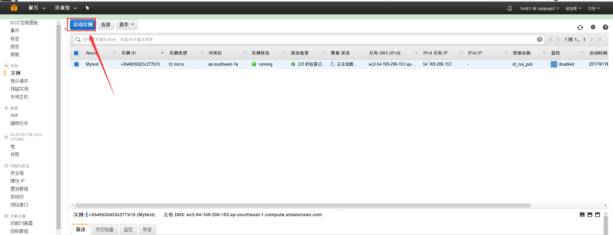
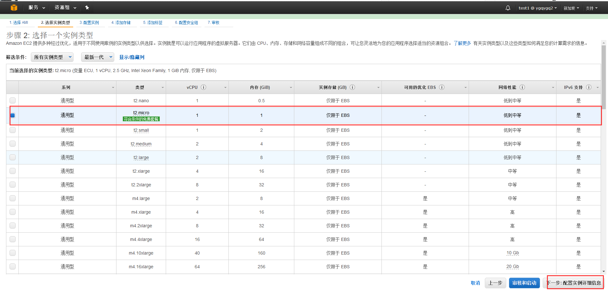
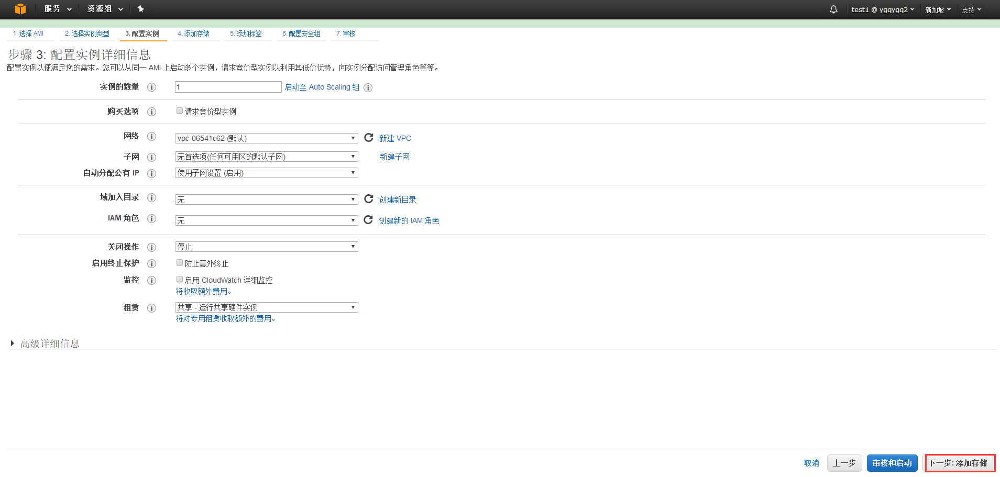
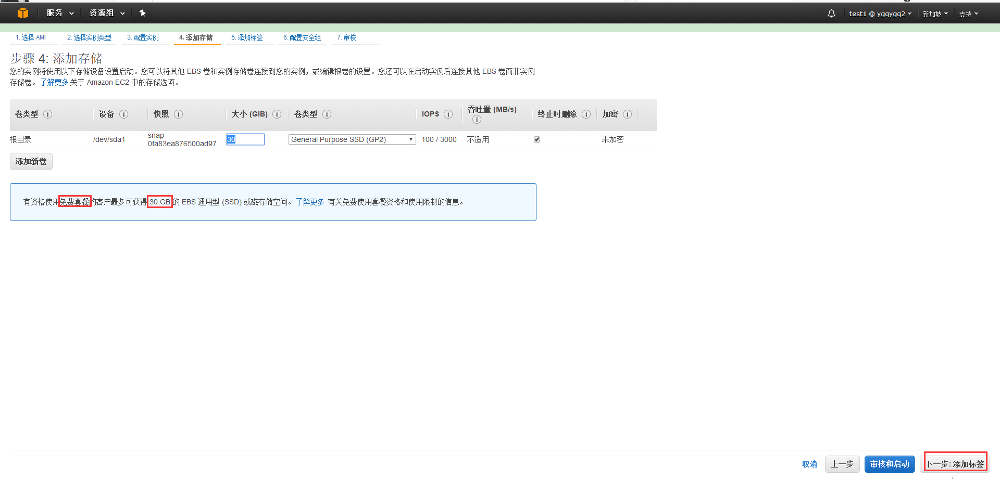
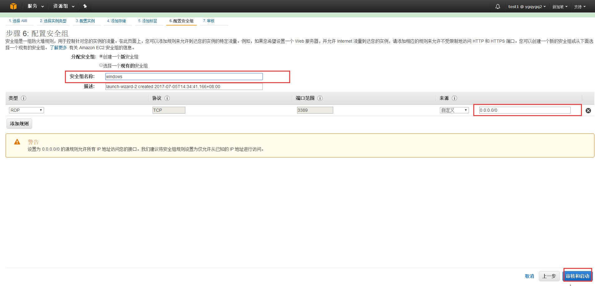
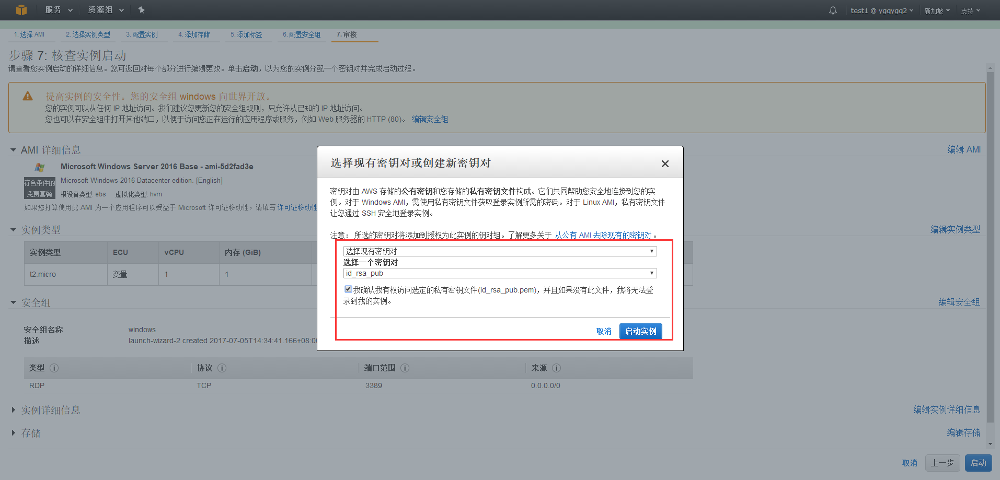
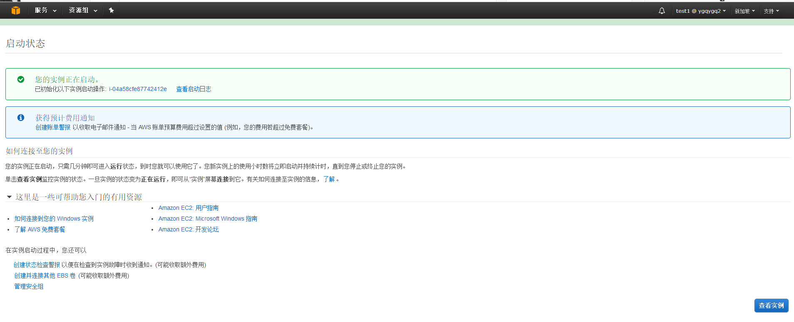
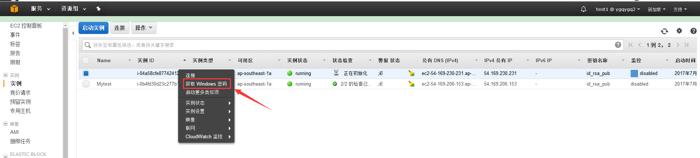
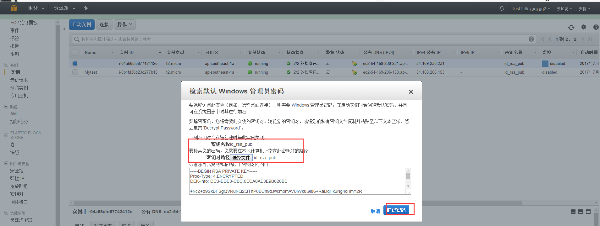

# 亚马逊 AWS 学习-创建 EC2 windows

[TOC]

最近刚换工作，也是第一次接触 AWS，在此记录学习 AWS。

## 1\. 在 EC2 中启动实例

## 2\. 选择免费 windows

## 3\. 查看相关硬件

 

## 4\. 选择安全组

## 5\. 选择密钥对

 

## 6\. 获取登录密码

 

得到密码后，就可以用远程桌面连接了。

相关文档： http://docs.aws.amazon.com/zh\_cn/AWSEC2/latest/WindowsGuide/get-set-up-for-amazon-ec2.html http://docs.aws.amazon.com/zh\_cn/AWSEC2/latest/WindowsGuide/concepts.html
