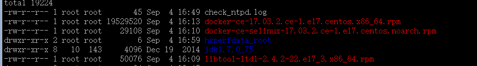

# CentOS7离线安装docker问题解决

\[TOC\]

因某些环境，不能联外网，所以使用docker yum源方法行不通，于是打算离线安装。 按此博客的方法http://www.cnblogs.com/aguncn/p/6863710.html，下载相应rpm安装。



`rpm -ivh *.rpm --nodeps --force`

安装后，启动，报库文件缺少错误，下面是整个问题和解决过程：

```
[root@test01 ~]# /usr/bin/dockerd 
/usr/bin/dockerd: error while loading shared libraries: libsystemd.so.0: cannot open shared object file: No such file or directory
[root@test01 ~]# find / -name libsystemd.so.0
find: ‘/proc/9409’: No such file or directory
find: ‘/proc/9410’: No such file or directory
c^C
[root@test01 ~]# /usr/bin/dockerd            
/usr/bin/dockerd: error while loading shared libraries: libsystemd.so.0: cannot open shared object file: No such file or directory
[root@test01 ~]# /usr/bin/dockerd 
/usr/bin/dockerd: error while loading shared libraries: libsystemd.so.0: cannot open shared object file: No such file or directory
[root@test01 ~]# yum -y install libsystemd
Loaded plugins: fastestmirror
Repodata is over 2 weeks old. Install yum-cron? Or run: yum makecache fast
file:///media/cdrom/repodata/repomd.xml: [Errno 14] curl#37 - "Couldn't open file /media/cdrom/repodata/repomd.xml"
Trying other mirror.
Loading mirror speeds from cached hostfile
   package libsystemd available.
▽rror: Nothing to do
You have new mail in /var/spool/mail/root
[root@test01 ~]# df -h
Filesystem                 Size  Used Avail Use% Mounted on
/dev/mapper/centos-root     27G  6.1G   21G  23% /
devtmpfs                   7.8G     0  7.8G   0% /dev
tmpfs                      7.8G     0  7.8G   0% /dev/shm
tmpfs                      7.8G  121M  7.7G   2% /run
tmpfs                      7.8G     0  7.8G   0% /sys/fs/cgroup
/dev/mapper/ftp_data-lv01   70G   33G   38G  47% /data/ftp
/dev/vda1                  497M  120M  378M  24% /boot
[root@test01 ~]# ls /etc/yum.repos.d/
bak  local.repo
[root@test01 ~]# more /etc/yum.repos.d/local.repo 
[local]
name=CentOS-$releasever - Plus
baseurl=file:///media/cdrom
gpgcheck=1
enabled=1
gpgkey=file:///etc/pki/rpm-gpg/RPM-GPG-KEY-CentOS-7
[root@test01 ~]# vim /etc/yum.repos.d/
bak/        local.repo  
[root@test01 ~]# vim /etc/yum.repos.d/local.repo 
[local]
name=CentOS-$releasever - Plus
baseurl=file:///media/cdrom
baseurl=http://10.42.187.246/centos7
gpgcheck=1
enabled=1
gpgkey=file:///etc/pki/rpm-gpg/RPM-GPG-KEY-CentOS-7
~                                                                                                                                                 
~                                                                                                                                                 

"/etc/yum.repos.d/local.repo" 7L, 177C written                                                                                  
[root@test01 ~]# yum -y install libsystemd
Loaded plugins: fastestmirror
Repodata is over 2 weeks old. Install yum-cron? Or run: yum makecache fast
local                                                                                                                      | 3.6 kB  00:00:00     
Loading mirror speeds from cached hostfile
No package libsystemd available.
Error: Nothing to do
[root@test01 ~]# yum -y install libsys*
Loaded plugins: fastestmirror
Loading mirror speeds from cached hostfile
Package libsysfs-2.1.0-16.el7.x86_64 already installed and latest version
Nothing to do
[root@test01 ~]# yum list|grep systemd
systemd.x86_64                          208-20.el7                     @anaconda
systemd-libs.x86_64                     208-20.el7                     @anaconda
systemd-sysv.x86_64                     208-20.el7                     @anaconda
systemd.x86_64                          219-30.el7                     local    
systemd-devel.x86_64                    219-30.el7                     local    
systemd-libs.x86_64                     219-30.el7                     local    
systemd-python.x86_64                   219-30.el7                     local    
systemd-sysv.x86_64                     219-30.el7                     local    
[root@test01 ~]# yum install systemd-libs
Loaded plugins: fastestmirror
Loading mirror speeds from cached hostfile
Resolving Dependencies
--> Running transaction check
---> Package systemd-libs.x86_64 0:208-20.el7 will be updated
--> Processing Dependency: systemd-libs = 208-20.el7 for package: systemd-208-20.el7.x86_64
---> Package systemd-libs.x86_64 0:219-30.el7 will be an update
--> Running transaction check
---> Package systemd.x86_64 0:208-20.el7 will be updated
--> Processing Dependency: systemd = 208-20.el7 for package: systemd-sysv-208-20.el7.x86_64
--> Processing Dependency: systemd = 208-20.el7 for package: libgudev1-208-20.el7.x86_64
---> Package systemd.x86_64 0:219-30.el7 will be an update
--> Processing Dependency: kmod >= 18-4 for package: systemd-219-30.el7.x86_64
--> Running transaction check
---> Package kmod.x86_64 0:14-10.el7 will be updated
---> Package kmod.x86_64 0:20-9.el7 will be an update
---> Package libgudev1.x86_64 0:208-20.el7 will be updated
---> Package libgudev1.x86_64 0:219-30.el7 will be an update
--> Processing Dependency: glib2 >= 2.42 for package: libgudev1-219-30.el7.x86_64
---> Package systemd-sysv.x86_64 0:208-20.el7 will be updated
---> Package systemd-sysv.x86_64 0:219-30.el7 will be an update
--> Running transaction check
---> Package glib2.x86_64 0:2.40.0-4.el7 will be updated
---> Package glib2.x86_64 0:2.46.2-4.el7 will be an update
--> Processing Conflict: systemd-219-30.el7.x86_64 conflicts initscripts < 9.49.28-1
--> Restarting Dependency Resolution with new changes.
--> Running transaction check
---> Package initscripts.x86_64 0:9.49.24-1.el7 will be updated
---> Package initscripts.x86_64 0:9.49.37-1.el7 will be an update
--> Processing Conflict: systemd-219-30.el7.x86_64 conflicts dracut < 033-243
--> Restarting Dependency Resolution with new changes.
--> Running transaction check
---> Package dracut.x86_64 0:033-240.el7 will be updated
--> Processing Dependency: dracut = 033-240.el7 for package: dracut-config-rescue-033-240.el7.x86_64
--> Processing Dependency: dracut = 033-240.el7 for package: dracut-network-033-240.el7.x86_64
---> Package dracut.x86_64 0:033-463.el7 will be an update
--> Running transaction check
---> Package dracut-config-rescue.x86_64 0:033-240.el7 will be updated
---> Package dracut-config-rescue.x86_64 0:033-463.el7 will be an update
---> Package dracut-network.x86_64 0:033-240.el7 will be updated
---> Package dracut-network.x86_64 0:033-463.el7 will be an update
--> Finished Dependency Resolution

Dependencies Resolved

==================================================================================================================================================
 Package                                    Arch                         Version                                Repository                   Size
==================================================================================================================================================
Updating:
 dracut                                     x86_64                       033-463.el7                            local                       317 k
 initscripts                                x86_64                       9.49.37-1.el7                          local                       431 k
 systemd-libs                               x86_64                       219-30.el7                             local                       367 k
Updating for dependencies:
 dracut-config-rescue                       x86_64                       033-463.el7                            local                        54 k
 dracut-network                             x86_64                       033-463.el7                            local                        96 k
 glib2                                      x86_64                       2.46.2-4.el7                           local                       2.3 M
 kmod                                       x86_64                       20-9.el7                               local                       115 k
 libgudev1                                  x86_64                       219-30.el7                             local                        75 k
 systemd                                    x86_64                       219-30.el7                             local                       5.2 M
 systemd-sysv                               x86_64                       219-30.el7                             local                        62 k

Transaction Summary
==================================================================================================================================================
Upgrade  3 Packages (+7 Dependent packages)

Total download size: 9.0 M
Is this ok [y/d/N]: y
Downloading packages:
Delta RPMs disabled because /usr/bin/applydeltarpm not installed.
(1/10): dracut-033-463.el7.x86_64.rpm                                                                                      | 317 kB  00:00:00     
(2/10): dracut-config-rescue-033-463.el7.x86_64.rpm                                                                        |  54 kB  00:00:00     
(3/10): dracut-network-033-463.el7.x86_64.rpm                                                                              |  96 kB  00:00:00     
(4/10): initscripts-9.49.37-1.el7.x86_64.rpm                                                                               | 431 kB  00:00:00     
(5/10): kmod-20-9.el7.x86_64.rpm                                                                                           | 115 kB  00:00:00     
(6/10): libgudev1-219-30.el7.x86_64.rpm                                                                                    |  75 kB  00:00:00     
(7/10): glib2-2.46.2-4.el7.x86_64.rpm                                                                                      | 2.3 MB  00:00:00     
(8/10): systemd-libs-219-30.el7.x86_64.rpm                                                                                 | 367 kB  00:00:00     
(9/10): systemd-219-30.el7.x86_64.rpm                                                                                      | 5.2 MB  00:00:00     
(10/10): systemd-sysv-219-30.el7.x86_64.rpm                                                                                |  62 kB  00:00:00     
--------------------------------------------------------------------------------------------------------------------------------------------------
Total                                                                                                              51 MB/s | 9.0 MB  00:00:00     
Running transaction check
Running transaction test
Transaction test succeeded
Running transaction
Warning: RPMDB altered outside of yum.
** Found 5 pre-existing rpmdb problem(s), 'yum check' output follows:
docker-ce-17.03.2.ce-1.el7.centos.x86_64 has missing requires of libcgroup
docker-ce-17.03.2.ce-1.el7.centos.x86_64 has missing requires of libdevmapper.so.1.02(DM_1_02_97)(64bit)
docker-ce-17.03.2.ce-1.el7.centos.x86_64 has missing requires of libseccomp.so.2()(64bit)
docker-ce-17.03.2.ce-1.el7.centos.x86_64 has missing requires of libsystemd.so.0()(64bit)
docker-ce-17.03.2.ce-1.el7.centos.x86_64 has missing requires of libsystemd.so.0(LIBSYSTEMD_209)(64bit)
  Updating   : glib2-2.46.2-4.el7.x86_64                                                                                                     1/20 
  Updating   : systemd-libs-219-30.el7.x86_64                                                                                                2/20 
  Updating   : kmod-20-9.el7.x86_64                                                                                                          3/20 
  Updating   : systemd-219-30.el7.x86_64                                                                                                     4/20 
  Updating   : dracut-033-463.el7.x86_64                                                                                                     5/20 
  Updating   : dracut-config-rescue-033-463.el7.x86_64                                                                                       6/20 
  Updating   : dracut-network-033-463.el7.x86_64                                                                                             7/20 
  Updating   : initscripts-9.49.37-1.el7.x86_64                                                                                              8/20 
warning: /etc/sysctl.conf created as /etc/sysctl.conf.rpmnew
  Updating   : systemd-sysv-219-30.el7.x86_64                                                                                                9/20 
  Updating   : libgudev1-219-30.el7.x86_64                                                                                                  10/20 
  Cleanup    : libgudev1-208-20.el7.x86_64                                                                                                  11/20 
  Cleanup    : initscripts-9.49.24-1.el7.x86_64                                                                                             12/20 
  Cleanup    : dracut-network-033-240.el7.x86_64                                                                                            13/20 
  Cleanup    : systemd-sysv-208-20.el7.x86_64                                                                                               14/20 
  Cleanup    : dracut-config-rescue-033-240.el7.x86_64                                                                                      15/20 
  Cleanup    : dracut-033-240.el7.x86_64                                                                                                    16/20 
  Cleanup    : systemd-208-20.el7.x86_64                                                                                                    17/20 
  Cleanup    : kmod-14-10.el7.x86_64                                                                                                        18/20 
  Cleanup    : systemd-libs-208-20.el7.x86_64                                                                                               19/20 
  Cleanup    : glib2-2.40.0-4.el7.x86_64                                                                                                    20/20 
  Verifying  : systemd-libs-219-30.el7.x86_64                                                                                                1/20 
  Verifying  : kmod-20-9.el7.x86_64                                                                                                          2/20 
  Verifying  : dracut-033-463.el7.x86_64                                                                                                     3/20 
  Verifying  : systemd-219-30.el7.x86_64                                                                                                     4/20 
  Verifying  : initscripts-9.49.37-1.el7.x86_64                                                                                              5/20 
  Verifying  : libgudev1-219-30.el7.x86_64                                                                                                   6/20 
  Verifying  : dracut-config-rescue-033-463.el7.x86_64                                                                                       7/20 
  Verifying  : systemd-sysv-219-30.el7.x86_64                                                                                                8/20 
  Verifying  : dracut-network-033-463.el7.x86_64                                                                                             9/20 
  Verifying  : glib2-2.46.2-4.el7.x86_64                                                                                                    10/20 
  Verifying  : systemd-sysv-208-20.el7.x86_64                                                                                               11/20 
  Verifying  : dracut-033-240.el7.x86_64                                                                                                    12/20 
  Verifying  : systemd-208-20.el7.x86_64                                                                                                    13/20 
  Verifying  : initscripts-9.49.24-1.el7.x86_64                                                                                             14/20 
  Verifying  : systemd-libs-208-20.el7.x86_64                                                                                               15/20 
  Verifying  : libgudev1-208-20.el7.x86_64                                                                                                  16/20 
  Verifying  : glib2-2.40.0-4.el7.x86_64                                                                                                    17/20 
  Verifying  : dracut-network-033-240.el7.x86_64                                                                                            18/20 
  Verifying  : dracut-config-rescue-033-240.el7.x86_64                                                                                      19/20 
  Verifying  : kmod-14-10.el7.x86_64                                                                                                        20/20 

Updated:
  dracut.x86_64 0:033-463.el7                 initscripts.x86_64 0:9.49.37-1.el7                 systemd-libs.x86_64 0:219-30.el7                

Dependency Updated:
  dracut-config-rescue.x86_64 0:033-463.el7   dracut-network.x86_64 0:033-463.el7   glib2.x86_64 0:2.46.2-4.el7        kmod.x86_64 0:20-9.el7  
  libgudev1.x86_64 0:219-30.el7               systemd.x86_64 0:219-30.el7           systemd-sysv.x86_64 0:219-30.el7  

Complete!
[root@test01 ~]# /usr/bin/dockerd         
/usr/bin/dockerd: error while loading shared libraries: libseccomp.so.2: cannot open shared object file: No such file or directory
[root@test01 ~]# yum list|grep systemd   
systemd.x86_64                          219-30.el7                     @local   
systemd-libs.x86_64                     219-30.el7                     @local   
systemd-sysv.x86_64                     219-30.el7                     @local   
systemd-devel.x86_64                    219-30.el7                     local    
systemd-python.x86_64                   219-30.el7                     local    
[root@test01 ~]# yum -y install systemd-devel
Loaded plugins: fastestmirror
Loading mirror speeds from cached hostfile
Resolving Dependencies
--> Running transaction check
---> Package systemd-devel.x86_64 0:219-30.el7 will be installed
--> Finished Dependency Resolution

Dependencies Resolved

==================================================================================================================================================
 Package                                Arch                            Version                              Repository                      Size
==================================================================================================================================================
Installing:
 systemd-devel                          x86_64                          219-30.el7                           local                          177 k

Transaction Summary
==================================================================================================================================================
Install  1 Package

Total download size: 177 k
Installed size: 337 k
Downloading packages:
systemd-devel-219-30.el7.x86_64.rpm                                                                                        | 177 kB  00:00:00     
Running transaction check
Running transaction test
Transaction test succeeded
Running transaction
  Installing : systemd-devel-219-30.el7.x86_64                                                                                                1/1 
  Verifying  : systemd-devel-219-30.el7.x86_64                                                                                                1/1 

Installed:
  systemd-devel.x86_64 0:219-30.el7                                                                                                               

Complete!
[root@test01 ~]# /usr/bin/dockerd            
/usr/bin/dockerd: error while loading shared libraries: libseccomp.so.2: cannot open shared object file: No such file or directory
[root@test01 ~]# yum -y install seccomp
Loaded plugins: fastestmirror
Loading mirror speeds from cached hostfile
No package seccomp available.
Error: Nothing to do
[root@test01 ~]# yum -y install sec
Loaded plugins: fastestmirror
Loading mirror speeds from cached hostfile
No package sec available.
Error: Nothing to do
[root@test01 ~]# yum -y install libseccomp
Loaded plugins: fastestmirror
Loading mirror speeds from cached hostfile
Resolving Dependencies
--> Running transaction check
---> Package libseccomp.x86_64 0:2.3.1-2.el7 will be installed
--> Finished Dependency Resolution

Dependencies Resolved

==================================================================================================================================================
 Package                             Arch                            Version                                 Repository                      Size
==================================================================================================================================================
Installing:
 libseccomp                          x86_64                          2.3.1-2.el7                             local                           56 k

Transaction Summary
==================================================================================================================================================
Install  1 Package

Total download size: 56 k
Installed size: 297 k
Downloading packages:
libseccomp-2.3.1-2.el7.x86_64.rpm                                                                                          |  56 kB  00:00:00     
Running transaction check
Running transaction test
Transaction test succeeded
Running transaction
  Installing : libseccomp-2.3.1-2.el7.x86_64                                                                                                  1/1 
  Verifying  : libseccomp-2.3.1-2.el7.x86_64                                                                                                  1/1 

Installed:
  libseccomp.x86_64 0:2.3.1-2.el7                                                                                                                 

Complete!
[root@test01 ~]# /usr/bin/dockerd      
/usr/bin/dockerd: /lib64/libdevmapper.so.1.02: version `DM_1_02_97' not found (required by /usr/bin/dockerd)
[root@test01 ~]# yum -y install libdevmapper
Loaded plugins: fastestmirror
Loading mirror speeds from cached hostfile
No package libdevmapper available.
Error: Nothing to do
[root@test01 ~]# yum list|grep mapper
device-mapper.x86_64                    7:1.02.93-3.el7                @anaconda
device-mapper-event.x86_64              7:1.02.93-3.el7                @anaconda
device-mapper-event-libs.x86_64         7:1.02.93-3.el7                @anaconda
device-mapper-libs.x86_64               7:1.02.93-3.el7                @anaconda
device-mapper-persistent-data.x86_64    0.4.1-2.el7                    @anaconda
device-mapper.x86_64                    7:1.02.135-1.el7               local    
device-mapper-event.x86_64              7:1.02.135-1.el7               local    
device-mapper-event-libs.x86_64         7:1.02.135-1.el7               local    
device-mapper-libs.x86_64               7:1.02.135-1.el7               local    
device-mapper-multipath.x86_64          0.4.9-99.el7                   local    
device-mapper-multipath-libs.x86_64     0.4.9-99.el7                   local    
device-mapper-persistent-data.x86_64    0.6.3-1.el7                    local    
[root@test01 ~]# yum -y install device-mapper-libs
Loaded plugins: fastestmirror
Loading mirror speeds from cached hostfile
Resolving Dependencies
--> Running transaction check
---> Package device-mapper-libs.x86_64 7:1.02.93-3.el7 will be updated
--> Processing Dependency: device-mapper-libs = 7:1.02.93-3.el7 for package: 7:device-mapper-1.02.93-3.el7.x86_64
---> Package device-mapper-libs.x86_64 7:1.02.135-1.el7 will be an update
--> Running transaction check
---> Package device-mapper.x86_64 7:1.02.93-3.el7 will be updated
--> Processing Dependency: device-mapper = 7:1.02.93-3.el7 for package: 7:device-mapper-event-1.02.93-3.el7.x86_64
---> Package device-mapper.x86_64 7:1.02.135-1.el7 will be an update
--> Running transaction check
---> Package device-mapper-event.x86_64 7:1.02.93-3.el7 will be updated
--> Processing Dependency: device-mapper-event = 7:1.02.93-3.el7 for package: 7:lvm2-libs-2.02.115-3.el7.x86_64
---> Package device-mapper-event.x86_64 7:1.02.135-1.el7 will be an update
--> Processing Dependency: device-mapper-event-libs = 7:1.02.135-1.el7 for package: 7:device-mapper-event-1.02.135-1.el7.x86_64
--> Running transaction check
---> Package device-mapper-event-libs.x86_64 7:1.02.93-3.el7 will be updated
---> Package device-mapper-event-libs.x86_64 7:1.02.135-1.el7 will be an update
---> Package lvm2-libs.x86_64 7:2.02.115-3.el7 will be updated
--> Processing Dependency: lvm2-libs = 7:2.02.115-3.el7 for package: 7:lvm2-2.02.115-3.el7.x86_64
---> Package lvm2-libs.x86_64 7:2.02.166-1.el7 will be an update
--> Running transaction check
---> Package lvm2.x86_64 7:2.02.115-3.el7 will be updated
---> Package lvm2.x86_64 7:2.02.166-1.el7 will be an update
--> Processing Dependency: device-mapper-persistent-data >= 0.6.3-1 for package: 7:lvm2-2.02.166-1.el7.x86_64
--> Running transaction check
---> Package device-mapper-persistent-data.x86_64 0:0.4.1-2.el7 will be updated
---> Package device-mapper-persistent-data.x86_64 0:0.6.3-1.el7 will be an update
--> Finished Dependency Resolution

Dependencies Resolved

==================================================================================================================================================
 Package                                          Arch                      Version                                Repository                Size
==================================================================================================================================================
Updating:
 device-mapper-libs                               x86_64                    7:1.02.135-1.el7                       local                    333 k
Updating for dependencies:
 device-mapper                                    x86_64                    7:1.02.135-1.el7                       local                    269 k
 device-mapper-event                              x86_64                    7:1.02.135-1.el7                       local                    177 k
 device-mapper-event-libs                         x86_64                    7:1.02.135-1.el7                       local                    177 k
 device-mapper-persistent-data                    x86_64                    0.6.3-1.el7                            local                    368 k
 lvm2                                             x86_64                    7:2.02.166-1.el7                       local                    1.1 M
 lvm2-libs                                        x86_64                    7:2.02.166-1.el7                       local                    983 k

Transaction Summary
==================================================================================================================================================
Upgrade  1 Package (+6 Dependent packages)

Total download size: 3.4 M
Downloading packages:
Delta RPMs disabled because /usr/bin/applydeltarpm not installed.
(1/7): device-mapper-1.02.135-1.el7.x86_64.rpm                                                                             | 269 kB  00:00:00     
(2/7): device-mapper-event-1.02.135-1.el7.x86_64.rpm                                                                       | 177 kB  00:00:00     
(3/7): device-mapper-event-libs-1.02.135-1.el7.x86_64.rpm                                                                  | 177 kB  00:00:00     
(4/7): device-mapper-libs-1.02.135-1.el7.x86_64.rpm                                                                        | 333 kB  00:00:00     
(5/7): device-mapper-persistent-data-0.6.3-1.el7.x86_64.rpm                                                                | 368 kB  00:00:00     
(6/7): lvm2-2.02.166-1.el7.x86_64.rpm                                                                                      | 1.1 MB  00:00:00     
(7/7): lvm2-libs-2.02.166-1.el7.x86_64.rpm                                                                                 | 983 kB  00:00:00     
--------------------------------------------------------------------------------------------------------------------------------------------------
Total                                                                                                             8.0 MB/s | 3.4 MB  00:00:00     
Running transaction check
Running transaction test
Transaction test succeeded
Running transaction
  Updating   : 7:device-mapper-libs-1.02.135-1.el7.x86_64                                                                                    1/14 
  Updating   : 7:device-mapper-1.02.135-1.el7.x86_64                                                                                         2/14 
  Updating   : 7:device-mapper-event-libs-1.02.135-1.el7.x86_64                                                                              3/14 
  Updating   : 7:device-mapper-event-1.02.135-1.el7.x86_64                                                                                   4/14 
  Updating   : 7:lvm2-libs-2.02.166-1.el7.x86_64                                                                                             5/14 
  Updating   : device-mapper-persistent-data-0.6.3-1.el7.x86_64                                                                              6/14 
  Updating   : 7:lvm2-2.02.166-1.el7.x86_64                                                                                                  7/14 
Created symlink from /etc/systemd/system/sysinit.target.wants/lvm2-lvmpolld.socket to /usr/lib/systemd/system/lvm2-lvmpolld.socket.
  Cleanup    : 7:lvm2-2.02.115-3.el7.x86_64                                                                                                  8/14 
  Cleanup    : 7:lvm2-libs-2.02.115-3.el7.x86_64                                                                                             9/14 
  Cleanup    : 7:device-mapper-event-1.02.93-3.el7.x86_64                                                                                   10/14 
  Cleanup    : 7:device-mapper-event-libs-1.02.93-3.el7.x86_64                                                                              11/14 
  Cleanup    : 7:device-mapper-1.02.93-3.el7.x86_64                                                                                         12/14 
  Cleanup    : 7:device-mapper-libs-1.02.93-3.el7.x86_64                                                                                    13/14 
  Cleanup    : device-mapper-persistent-data-0.4.1-2.el7.x86_64                                                                             14/14 
  Verifying  : 7:device-mapper-event-libs-1.02.135-1.el7.x86_64                                                                              1/14 
  Verifying  : 7:device-mapper-1.02.135-1.el7.x86_64                                                                                         2/14 
  Verifying  : 7:lvm2-2.02.166-1.el7.x86_64                                                                                                  3/14 
  Verifying  : device-mapper-persistent-data-0.6.3-1.el7.x86_64                                                                              4/14 
  Verifying  : 7:device-mapper-libs-1.02.135-1.el7.x86_64                                                                                    5/14 
  Verifying  : 7:lvm2-libs-2.02.166-1.el7.x86_64                                                                                             6/14 
  Verifying  : 7:device-mapper-event-1.02.135-1.el7.x86_64                                                                                   7/14 
  Verifying  : 7:lvm2-2.02.115-3.el7.x86_64                                                                                                  8/14 
  Verifying  : 7:device-mapper-event-1.02.93-3.el7.x86_64                                                                                    9/14 
  Verifying  : 7:lvm2-libs-2.02.115-3.el7.x86_64                                                                                            10/14 
  Verifying  : 7:device-mapper-libs-1.02.93-3.el7.x86_64                                                                                    11/14 
  Verifying  : 7:device-mapper-event-libs-1.02.93-3.el7.x86_64                                                                              12/14 
  Verifying  : 7:device-mapper-1.02.93-3.el7.x86_64                                                                                         13/14 
  Verifying  : device-mapper-persistent-data-0.4.1-2.el7.x86_64                                                                             14/14 

Updated:
  device-mapper-libs.x86_64 7:1.02.135-1.el7                                                                                                      

Dependency Updated:
  device-mapper.x86_64 7:1.02.135-1.el7              device-mapper-event.x86_64 7:1.02.135-1.el7 device-mapper-event-libs.x86_64 7:1.02.135-1.el7
  device-mapper-persistent-data.x86_64 0:0.6.3-1.el7 lvm2.x86_64 7:2.02.166-1.el7                lvm2-libs.x86_64 7:2.02.166-1.el7               

Complete!
[root@test01 ~]# /usr/bin/dockerd                 
INFO[0000] libcontainerd: new containerd process, pid: 11630 
WARN[0001] overlay: the backing xfs filesystem is formatted without d_type support, which leads to incorrect behavior. Reformat the filesystem with ftype=1 to enable d_type support. Running without d_type support will no longer be supported in Docker 17.12. 
INFO[0001] Graph migration to content-addressability took 0.00 seconds 
WARN[0001] mountpoint for pids not found                
INFO[0001] Loading containers: start.                   
WARN[0001] Running modprobe bridge br_netfilter failed with message: modprobe: WARNING: Module br_netfilter not found.
insmod /lib/modules/3.10.0-229.el7.x86_64/kernel/net/llc/llc.ko 
insmod /lib/modules/3.10.0-229.el7.x86_64/kernel/net/802/stp.ko 
insmod /lib/modules/3.10.0-229.el7.x86_64/kernel/net/bridge/bridge.ko 
, error: exit status 1 
INFO[0001] Firewalld running: false                     
INFO[0001] Default bridge (docker0) is assigned with an IP address 172.17.0.0/16. Daemon option --bip can be used to set a preferred IP address 
INFO[0001] Loading containers: done.                    
```

总结： 安装docker rpm前，需要使用 `yum -y install systemd-devel systemd-libs libseccomp device-mapper-libs` 这些rpm包，可使用CentOS7官方ISO制作成本地yum源安装。

资料： \[1\] http://www.cnblogs.com/aguncn/p/6863710.html
