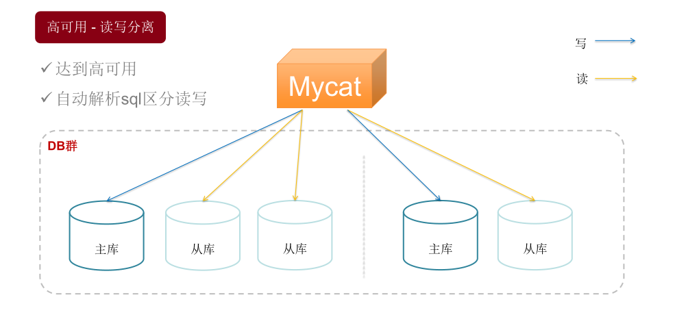
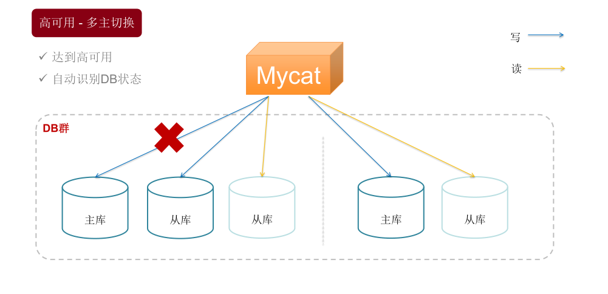
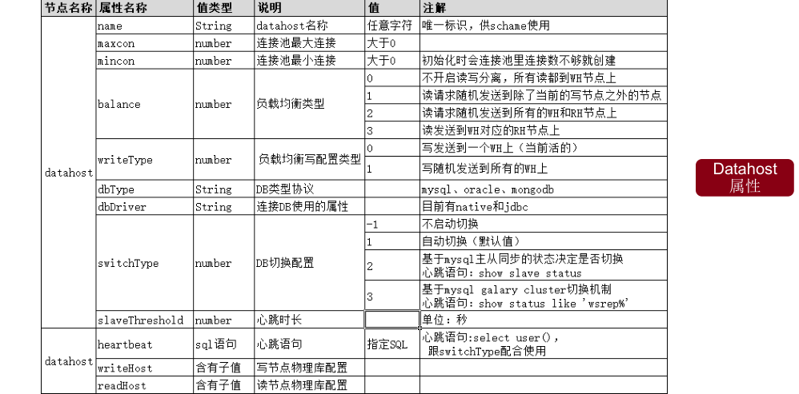

# Mycat 学习实战-Mycat 基本功能

[TOC]

## 1\. Mycat 高可用-读写分离



### 1.1 读写分离配置参数

Schema.dataHost 参数 balance 设置值： 1. balance="0", 不开启读写分离机制，所有读操作都发送到当前可用的 writeHost 上。 2. balance="1"，全部的 readHost 与 stand by writeHost 参与 select 语句的负载均衡， 简单的说，当双主双从模式(M1->S1，M2->S2，并且 M1 与 M2 互为主备)， 正常情况下，M2,S1,S2 都参与 select 语句的负载均衡。 3. balance="2"，所有读操作都随机的在 writeHost、readhost 上分发。 4. balance="3"，所有读请求随机的分发到 wiriterHost 对应的 readhost 执行，writerHost 不负担读压力

事务内的 SQL，默认走写节点，以注释/_balance_/开头，则会根据 balance=“1”或“2”去获取 b. 非事务内的 SQL，开启读写分离默认根据 balance=“1”或“2”去获取，以注释/_balance_/开头则会走写解决部分已 经开启读写分离，但是需要强一致性数据实时获取的场景走写

### 1.2 心跳配置参数

switchType=“1” ：基于基本的表访问判断 `schema.xml`

```
<dataHost name="localhost1" maxCon="1000" minCon="10" balance="0" writeType="0"
dbType="mysql" dbDriver="native" switchType=“1" slaveThreshold="100">
    <heartbeat>select user()</heartbeat>
    <writeHost host="hostM1" url="localhost:3306" user="root“ password="123456" />
    <writeHost host="hostS1" url="localhost:3316" user="root“ password="123456" />
</dataHost>
```

switchType=“2” ： show slave status 会显示主从同步状态 `schema.xml`

```
<dataHost name="localhost1" maxCon="1000" minCon="10" balance="0" writeType="0"
dbType="mysql" dbDriver="native" switchType="2" slaveThreshold="100">
    <heartbeat>show slave status </heartbeat>
    <writeHost host="hostM1" url="localhost:3306" user="root“ password="123456" />
    <writeHost host="hostS1" url="localhost:3316" user="root“ password="123456" />
</dataHost>
```

> Mycat 心跳机制通过检测 show slave status 中的 "Seconds_Behind_Master", "Slave_IO_Running", "Slave_SQL_Running" 三个字段来确定当前主从同步的状态以及 Seconds_Behind_Master 主从复制时延，当 Seconds_Behind_Master>slaveThreshold 时，读写分离筛选器会过滤掉此 Slave 机器。

switchType="3" ,MyCAT 心跳检查语句配置为 show status like ‘wsrep%’ ，开启 MySQL 集群复制状态状态绑定的读写分离与切换机制 `schema.xml`

```
<dataHost name="localhost1" maxCon="1000" minCon="10" balance="0" writeType="0"
dbType="mysql" dbDriver="native" switchType="3" >
    <heartbeat> show status like ‘wsrep%’</heartbeat>
    <writeHost host="hostM1" url="localhost:3306" user="root“ password="123456"> </writeHost>
    <writeHost host="hostS1“ url="localhost:3316"user="root“ password="123456" ></writeHost>
</dataHost>
```

> 配置文件：conf/log4j2.xml 日志文件：logs/mycat.log 说明：修改 log4j 日志收集为 debug 方式，通过 log 信息可以分析出来是否读写分离发 生在那个节点

## 2\. Mycat 高可用-多主切换



### 2.1 主从切换配置参数

`schema.xml`

```
<dataHost name="dh-01" maxCon="1000" minCon="10" balance="1“ writeType="0"
dbType="mysql" dbDriver="native" switchType="1" slaveThreshold="100">
    <heartbeat>select user()</heartbeat>
    <writeHost host="hostM1" url="localhost:3306" user="root“ password="root"></writeHost>
    <writeHost host="hostS1" url="localhost:3306" user="root“ password="root"></writeHost>
</dataHost>
```

> 需要配置多个`writeHost`节点

switchType 属性 • -1 表示不自动切换 • 1 默认值，自动切换 • 2 基于 MySQL 主从同步的状态决定是否切换 ，心跳语句为`show slave status` • 3 基于 MySQL galary cluster 的切换机制（适合集群）心跳语句为 `show status like ‘wsrep%’`

### 2.2 主从切换标记

`conf/dnindex.properties`

```
#update
#Tue Jul 25 14:20:40 CST 2017
dh-01=0
```

使用中注意事项： • 前提是的配置至少 2 个 writeHost • 并且开启自动切换 • 能不自动切就别自动切 • 能手动执行就不要自动 • 数据丢失问题 • 原主加入后当从

## 3 注解

mycat 对不支持的 sql 提供一种方案即为注解（在要执行的 sql 语句前添加额外的一段由注解 sql 组成的代码，这样 sql 就能正确执行，相当于对不支持的 sql 语句做了一层透明代理转发。） 形式是： `/*!mycat: sql=Sql语句*/真正执行Sql` 注解支持的'!'不被 mysql 单库兼容， 注解支持的'#'不被 mybatis 兼容 新增加 mycat 字符前缀标志 Hintsql:"/\*\* mycat: \*/"

参数说明整理列表： 

参考资料： \[1\] [http://mycat.io/](http://mycat.io/) \[2\] 《分布式数据库架构及企业实践——基于 Mycat 中间件》 \[3\] 龙哥官方课程课件
