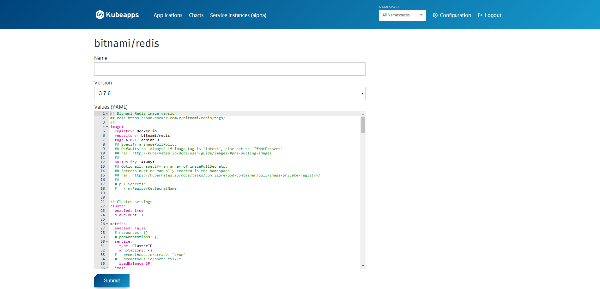

# Kubernetes上如何使用Helm

\[TOC\]

## 1\. 环境说明

操作系统：CentOS7 kubernetes：1.11

## 2\. helm安装

```bash
# 下载脚本并执行安装
curl https://raw.githubusercontent.com/kubernetes/helm/master/scripts/get > get_helm.sh
bash get_helm.sh
```

```bash
# 查看Helm客户端的版本号
helm version
```

注意版本号，后续容器服务的版本要和这个一致, 否则会出现问题。

```
Client: &version.Version{SemVer:"v2.9.1", GitCommit:"20adb27c7c5868466912eebdf6664e7390ebe710", GitTreeState:"clean"}
```

```bash
# 在 Kubernetes 群集上安装 Tiller(helm服务端)，注意和上面版本号一致
helm init --upgrade -i registry.cn-hangzhou.aliyuncs.com/google_containers/tiller:v2.9.1 --stable-repo-url https://kubernetes.oss-cn-hangzhou.aliyuncs.com/charts
```

> 说明： `helm init --upgrade`会在Kubernetes集群上安装配置Tiller, 仓库默认使用https://kubernetes-charts.storage.googleapis.com 。由于国内无法访问相关域名，可以使用阿里云容器服务提供的镜像和站点。

查看容器运行情况

`kubectl get pod --all-namespaces|grep tiller`

```
kube-system   tiller-deploy-b67849f44-cs4qr               1/1       Running            0          46m
```

从Kubernetes 1.6开始，API Server启用了RBAC授权。而Tiller部署没有定义授权的ServiceAccount，这会导致访问API Server时被拒绝。我们可以采用如下方法，为Tiller部署添加授权。

```bash
kubectl create serviceaccount --namespace kube-system tiller
kubectl create clusterrolebinding tiller-cluster-rule --clusterrole=cluster-admin --serviceaccount=kube-system:tiller
kubectl patch deploy --namespace kube-system tiller-deploy -p '{"spec":{"template":{"spec":{"serviceAccount":"tiller"}}}}'
```

```
# 查看已部署的应用
helm list
```

卸载helm服务端

```bash
helm reset
# helm reset --force
```

## 3\. helm使用

```bash
# 先移除原先的仓库
helm repo remove stable
# 添加新的仓库地址
helm repo add stable https://kubernetes.oss-cn-hangzhou.aliyuncs.com/charts
# 更新仓库
helm repo update
```

## 4\. 安装Monocular

Monocular基于web的用户界面，用于管理Kubernetes应用打包为Helm Charts。它允许您从多个存储库搜索和发现可用Chats,并安装在您的集群中，只需要鼠标点点就能完成。

准备条件 \* Helm和Tiller已安装 \* Nginx Ingress controller已安装 \* Install with Helm: `helm install stable/nginx-ingress` \* Minikube/Kubeadm: `helm install stable/nginx-ingress --set controller.hostNetwork=true`

安装

```bash
helm repo add monocular https://helm.github.io/monocular
helm install --name monocular monocular/monocular
```

默认它是配置到ingress中的，通过ingress节点IP就能访问。

> 注意 安装过程中，pvc创建提示失败，需要手动干预提供可用pvc。


## 5\. 安装Kubeapps

kubeapps是一个基于web的用户界面，用于部署和管理在kubernetes群集中的应用程序。Kubeapps允许你： \* 浏览并部署存储库中的chats \* 检查、升级和删除集群中安装的基于`helm`的应用程序 \* 添加自定义和私有的chat存储库（支持[ChartMuseum](https://github.com/helm/chartmuseum) and [JFrog Artifactory](https://www.jfrog.com/confluence/display/RTF/Helm+Chart+Repositories)) \* 浏览并提供来自[Service Catalog](https://github.com/kubernetes-incubator/service-catalog)的外部服务和可用的服务中介 \* 用服务目录绑定基于`helm`的应用程序连接到外部服务 \* 基于kubernetes RBAC的安全认证和授权

安装

```
kubectl create namespace kubeapps
helm repo add bitnami https://charts.bitnami.com/bitnami
helm install --name kubeapps --namespace kubeapps bitnami/kubeapps
```



## 6\. 2个工具对比

1. 在功能上，2个基本一样；
2. 用户体验上，当前2个的最新版本，Kubeapps（v1.0.0-alpha.6）要优于Monocular（0.7.3），部署时Kubeapps能让用户直接修改一些默认参数；
3. 安全上，Kubeapps直接使用Kubernetes的RBAC，和Kubernetes的dashboard的toke登录方式一样。Monocular登录功能用不了；
4. 对外提供访问上，Kubeapps的`kubectl port-forward`不推荐，最好配置ingress，而Monocular已自动配置ingress；

## 7\. chart repo

chart repo是一个可用来存储index.yml与打包的chart文件的HTTP server。  
当要分享chart时，需要上传chart文件到chart仓库。任何一个能能够提供YAML与tar文件的HTTP server都可以当做chart仓库，比如Google Cloud Storage (GCS) bucket、Amazon S3 bucket、Github Pages或创建你自己的web服务器。官方chart仓库由Kubernetes Charts维护， Helm允许我们创建私有chart仓库。

### 7.1 chart repo结构

查看目前的repo，`helm repo list`

```
NAME            URL                                                      
stable          https://kubernetes.oss-cn-hangzhou.aliyuncs.com/charts   
local           http://localhost:8879/charts                             
monocular       https://helm.github.io/monocular                         
bitnami         https://charts.bitnami.com/bitnami                       
incubator       http://storage.googleapis.com/kubernetes-charts-incubator
```

`helm`执行tiller命令后默认会配置一个名为l的本地repo。

一个chart仓库由一个chart包与`index.yaml`文件组成，`index.yaml`记录了chart仓库中全部chart的索引，一个本地chart仓库的布局例子如下：

```
~/.helm/
|-- cache
| `-- archive
| |-- drupal-0.9.2.tgz
| `-- mariadb-1.0.3.tgz
|-- plugins
|-- repository
| |-- cache
| | |-- fantastic-charts-index.yaml
| | |-- local-index.yaml -> /home/ts1/.helm/repository/local/index.yaml
| | |-- mariadb-1.0.3.tgz-index.yaml
| | |-- memcached-1.2.1.tgz-index.yaml
| | |-- mychart_xia-0.1.0.tgz-index.yaml
| | |-- mysql-0.2.8.tgz-index.yaml
| | |-- stable-index.yaml
| | |-- test-0.1.0.tgz-index.yaml
| | `-- test-0.1.8.tgz-index.yaml
| |-- local
| | |-- index.yaml
| | |-- mychart-0.1.0.tgz
| | |-- mychart_xia-0.1.0.tgz
| | |-- mysql-0.2.8.tgz
| | |-- mysql-6.19.centos-29.tgz
| | |-- test-0.1.0.tgz
| | |-- test-0.1.8.tgz
| | `-- test-0.1.9.tgz
| `-- repositories.yaml
`-- starters
```

~/.helm/repository/local/index.yaml文件中记录了chart的诸如名称、url、version等一些metadata信息。

### 7.2 启动repo服务

```bash
mkdir -p /data/helm/charts
cat > /data/helm/start_local_helm.sh <<EOF
#!/usr/bin/env bash

helm_path=\$(which helm)
helm_pid=\$(pidof \$helm_path)
helm_data_path="/data/helm/charts"

if [ -z "\$helm_pid" ]; then
    cd \$helm_data_path
    nohup \$helm_path serve --address 0.0.0.0:8879 --repo-path \$helm_data_path &
else
    echo -e "helm already running."
fi

exit 0
EOF
sh /data/helm/start_local_helm.sh
```

* * *

`helm serve --help`

```
This command starts a local chart repository server that serves charts from a local directory.

The new server will provide HTTP access to a repository. By default, it will
scan all of the charts in '$HELM_HOME/repository/local' and serve those over
the local IPv4 TCP port (default '127.0.0.1:8879').

This command is intended to be used for educational and testing purposes only.
It is best to rely on a dedicated web server or a cloud-hosted solution like
Google Cloud Storage for production use.

See https://github.com/kubernetes/helm/blob/master/docs/chart_repository.md#hosting-chart-repositories
for more information on hosting chart repositories in a production setting.

Usage:
  helm serve [flags]

Flags:
      --address string     address to listen on (default "127.0.0.1:8879")
      --repo-path string   local directory path from which to serve charts
      --url string         external URL of chart repository

Global Flags:
      --debug                           enable verbose output
      --home string                     location of your Helm config. Overrides $HELM_HOME (default "/root/.helm")
      --host string                     address of Tiller. Overrides $HELM_HOST
      --kube-context string             name of the kubeconfig context to use
      --tiller-connection-timeout int   the duration (in seconds) Helm will wait to establish a connection to tiller (default 300)
      --tiller-namespace string         namespace of Tiller (default "kube-system")
```

* * *

添加本地repo `helm repo add local http://192.168.105.92:8879/charts`

### 7.3 向repo中增加软件包

上面步骤中，已经创建了一个本地的repo，接下来讲述如何在repo中增加一个可用来部署的软件包chart。chart须遵循 SemVer 2 规则填写正确的版本格式。各种chart包可以在[github](https://github.com/kubernetes/charts)下载。

因为官方chart里的image镜像被墙的可能和自己定制参数的设置，我们将修改过的chart添加到本机chart中。

```bash
cd /data/helm
helm fetch incubator/zookeeper --untar
helm package zookeeper
mv zookeeper-1.1.1.tgz charts/
```

> 注 `helm package`的作用是在当前目录下将软件打包为tgz，假如这个软件包中有requirement.yaml，则打包时还需要加上`--dependency-update`，用来`update dependencies from "requirements.yaml" to dir "charts/" before packaging`

更新index.yaml文件

```bash
cd /data/helm
helm repo index charts --url http://192.168.105.92:8879/charts
helm repo remove local
helm repo add local http://192.168.105.92:8879/charts
```

查看chart是否上传仓库成功： `helm search zookeeper|grep local`

```
local/zookeeper         1.1.1           3.4.10          Centralized service for maintaining configurati...
```

## 8\. 应用部署和版本管理

获取chart 获取版本为0.3.5的mysql并解压缩包：

```bash
$ helm fetch stable/mysql --version 0.3.5 --untar
$ ls mysql/
Chart.yaml  README.md  templates  values.yaml
$ helm lint mysql
==> Linting mysql
Lint OK

1 chart(s) linted, no failures
```

利用helm lint命令检查下载的chart是否存在问题：

```
$ helm lint mysql
==> Linting mysql
Lint OK
1 chart(s) linted, no failures
```

创建自定义chart `helm create mychart`

查看mychart结构：

```
mychart/
├── charts
├── Chart.yaml
├── templates
│   ├── deployment.yaml
│   ├── _helpers.tpl
│   ├── ingress.yaml
│   ├── NOTES.txt
│   └── service.yaml
└── values.yaml

2 directories, 7 files
```

生成chart目录里有`Chart.yaml`, `values.yaml` and `NOTES.txt`等文件，下面分别对chart中几个重要文件解释： `Chart.yaml` 包含了chart的metadata，描述了Chart名称、描述信息与版本。 `values.yaml`：存储了模板文件变量。 `templates/`：记录了全部模板文件。 `charts/`：依赖chart存储路径。

其中`mychart/templates/`的文件及其作用如下： `NOTES.txt`：给出了部署chart后的帮助文档，例如如何使用chart、列出默认的设置等。 `deployment.yaml`：创建 Kubernetes deployment的yaml文件。 `service.yaml`：创建deployment的service endpoint yams文件。 `_helpers.tpl`: 模板使用帮助文件。

chart安装有以下几种方式： 指定chart: `helm install stable/mariadb` 指定打包的chart: `helm install ./nginx-1.2.3.tgz` 指定打包目录: `helm install ./nginx` 指定chart包URL: `helm install https://example.com/charts/nginx-1.2.3.tgz`

覆盖chart中的默认值，通过指定配置文件方式： `helm install -f myvalues.yaml ./redis`

或者通过–set key=value形式： `helm install --set name=prod ./redis`

安装release名称为mysql例子如下，请注意NOTES中对Mysql的使用说明：

`vim mysql/values.yaml`

找到storageClass，并修改其值，这里我们使用可用的动态卷`ceph-rbd`

```yaml
  storageClass: "ceph-rbd"`
```

**安装release**

```
[root@lab1 helm]# helm install -n mysql -f mysql/values.yaml --set resources.requests.memory=512Mi mysql 
NAME:   mysql
LAST DEPLOYED: Mon Aug 27 11:23:27 2018
NAMESPACE: default
STATUS: DEPLOYED

RESOURCES:
==> v1/Secret
NAME         TYPE    DATA  AGE
mysql-mysql  Opaque  2     0s

==> v1/PersistentVolumeClaim
NAME         STATUS   VOLUME    CAPACITY  ACCESS MODES  STORAGECLASS  AGE
mysql-mysql  Pending  ceph-rbd  0s

==> v1/Service
NAME         TYPE       CLUSTER-IP     EXTERNAL-IP  PORT(S)   AGE
mysql-mysql  ClusterIP  10.101.206.24  <none>       3306/TCP  0s

==> v1beta1/Deployment
NAME         DESIRED  CURRENT  UP-TO-DATE  AVAILABLE  AGE
mysql-mysql  1        1        1           0          0s

==> v1/Pod(related)
NAME                          READY  STATUS   RESTARTS  AGE
mysql-mysql-7f56cd565b-sfmgj  0/1    Pending  0         0s


NOTES:
MySQL can be accessed via port 3306 on the following DNS name from within your cluster:
mysql-mysql.default.svc.cluster.local

To get your root password run:

    MYSQL_ROOT_PASSWORD=$(kubectl get secret --namespace default mysql-mysql -o jsonpath="{.data.mysql-root-password}" | base64 --decode; echo)

To connect to your database:

1. Run an Ubuntu pod that you can use as a client:

    kubectl run -i --tty ubuntu --image=ubuntu:16.04 --restart=Never -- bash -il

2. Install the mysql client:

    $ apt-get update && apt-get install mysql-client -y

3. Connect using the mysql cli, then provide your password:
    $ mysql -h mysql-mysql -p

To connect to your database directly from outside the K8s cluster:
    MYSQL_HOST=127.0.0.1
    MYSQL_PORT=3306

    # Execute the following commands to route the connection:
    export POD_NAME=$(kubectl get pods --namespace default -l "app=mysql-mysql" -o jsonpath="{.items[0].metadata.name}")
    kubectl port-forward $POD_NAME 3306:3306

    mysql -h ${MYSQL_HOST} -P${MYSQL_PORT} -u root -p${MYSQL_ROOT_PASSWORD}
```

查看release状态`helm status mysql`

```
NAME:   mysql
LAST DEPLOYED: Mon Aug 27 11:23:27 2018
NAMESPACE: default
STATUS: DEPLOYED
```

或通过helm list -a查看全部的release，tag “-a”是查看全部的release，包括已部署、部署失败、正在删除、已删除release等。

**更新release**

`helm upgrade mysql -f mysql/values.yaml --set resources.requests.memory=1024Mi mysql`

查看指定release的历史部署版本信息：

```
[root@lab1 helm]# helm hist mysql 
REVISION        UPDATED                         STATUS          CHART           DESCRIPTION     
1               Mon Aug 27 11:23:27 2018        SUPERSEDED      mysql-0.3.5     Install complete
2               Mon Aug 27 11:26:09 2018        DEPLOYED        mysql-0.3.5     Upgrade complete
```

查看指定release的历史版本部署时部分配置信息，以resources.requests.memory为例，符合查看部署符合预期：即第一次部署resources.requests.memory设置为512Mi，第二次的升级resources.requests.memory设置为1024Mi：

`helm get --revision 1 mysql`

**版本回滚**

回滚到第一次的版本：

```
[root@lab1 helm]# helm rollback --debug mysql 1
[debug] Created tunnel using local port: '44164'

[debug] SERVER: "127.0.0.1:44164"

Rollback was a success! Happy Helming!
```

查看mysql release的版本信息，当前已经回滚到REVISION为1的版本：

```
[root@lab1 helm]# helm hist mysql              
REVISION        UPDATED                         STATUS          CHART           DESCRIPTION     
1               Mon Aug 27 11:23:27 2018        SUPERSEDED      mysql-0.3.5     Install complete
2               Mon Aug 27 11:26:09 2018        SUPERSEDED      mysql-0.3.5     Upgrade complete
3               Mon Aug 27 11:29:24 2018        SUPERSEDED      mysql-0.3.5     Rollback to 1 
```

**删除release**

```
[root@lab1 helm]# helm delete mysql
release "mysql" deleted
```

确认release 是否删除：

```
[root@lab1 helm]# helm ls -a mysql
NAME    REVISION        UPDATED                         STATUS  CHART           NAMESPACE
mysql   4               Mon Aug 27 11:29:45 2018        DELETED mysql-0.3.5     default 
```

即使删除的release ，其发布的历史信息还是继续被保存。

```
[root@lab1 helm]# helm hist mysql
REVISION        UPDATED                         STATUS          CHART           DESCRIPTION      
1               Mon Aug 27 11:23:27 2018        SUPERSEDED      mysql-0.3.5     Install complete 
2               Mon Aug 27 11:26:09 2018        SUPERSEDED      mysql-0.3.5     Upgrade complete 
3               Mon Aug 27 11:29:24 2018        SUPERSEDED      mysql-0.3.5     Rollback to 1    
4               Mon Aug 27 11:29:45 2018        DELETED         mysql-0.3.5     Deletion complete
```

可以恢复一个已经删除的release：

```
[root@lab1 helm]# helm rollback --debug mysql 2
[debug] Created tunnel using local port: '33811'

[debug] SERVER: "127.0.0.1:33811"

Error: "mysql" has no deployed releases

```

如果希望彻底删除一个release，可以用如下命令：

```
[root@lab1 helm]# helm delete --purge mysql
release "mysql" deleted
```

再次查看刚被删除的mysql release，提示已经无法找到，符合预期：

```
[root@lab1 helm]# helm hist mysql
Error: release: "mysql" not found
```

Helm对release的版本管理  
在上面例子中，已经展示了Helm对release的非常强大的版本管理功能，比如通过`helm list -a`查看有哪些release，通过`helm hist`查看某一个具体的release发布过的历史版本，以及通过`helm get --revision`，查看某个release的一次历史版本对应的具体应用配置信息等。即使已经被删除的release仍然有记录，并且通过Helm能够快速回滚到已删除release的某个发布过的历史版本。Helm的这些版本管理功能，Kubernetes原生并不支持。

参考资料：  
\[1\] https://helm.sh/  
\[2\] https://whmzsu.github.io/helm-doc-zh-cn/  
\[3\] [简化Kubernetes应用部署工具-Helm简介](http://dockone.io/article/2701)  
\[4\] [简化Kubernetes应用部署工具-Helm安装](http://dockone.io/article/2702)  
\[5\] [简化Kubernetes应用部署工具-Helm之应用部署](http://dockone.io/article/2703)  
\[6\] [简化Kubernetes应用部署工具-Helm之Release配置](http://dockone.io/article/2705)  
\[7\] https://github.com/helm/monocular  
\[8\] https://github.com/kubeapps/kubeapps
