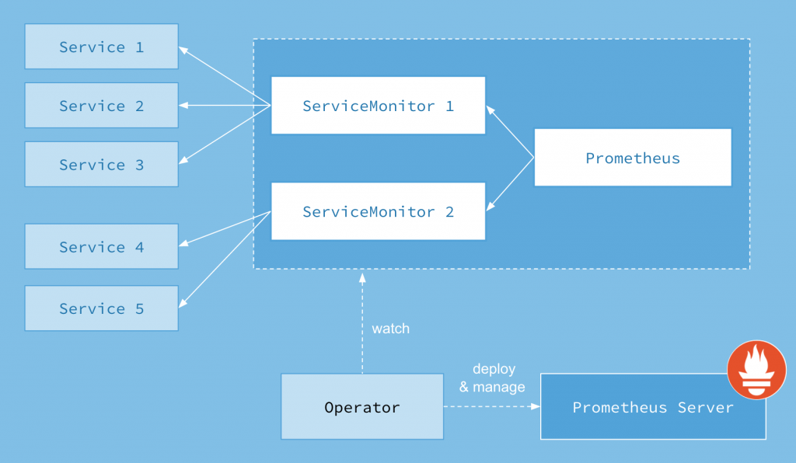

# Kubernetes更优雅的监控工具Prometheus Operator

\[TOC\]

## 1\. Kubernetes Operator 介绍

在 Kubernetes 的支持下，管理和伸缩 Web 应用、移动应用后端以及 API 服务都变得比较简单了。其原因是这些应用一般都是无状态的，所以 Deployment 这样的基础 Kubernetes API 对象就可以在无需附加操作的情况下，对应用进行伸缩和故障恢复了。

而对于数据库、缓存或者监控系统等有状态应用的管理，就是个挑战了。这些系统需要应用领域的知识，来正确的进行伸缩和升级，当数据丢失或不可用的时候，要进行有效的重新配置。我们希望这些应用相关的运维技能可以编码到软件之中，从而借助 Kubernetes 的能力，正确的运行和管理复杂应用。

Operator 这种软件，使用 TPR(第三方资源，现在已经升级为 CRD) 机制对 Kubernetes API 进行扩展，将特定应用的知识融入其中，让用户可以创建、配置和管理应用。和 Kubernetes 的内置资源一样，Operator 操作的不是一个单实例应用，而是集群范围内的多实例。

## 2\. Prometheus Operator介绍

Kubernetes的Prometheus Operator为Kubernetes服务和Prometheus实例的部署和管理提供了简单的监控定义。

安装完毕后，Prometheus Operator提供了以下功能：

- **创建/毁坏**: 在Kubernetes namespace中更容易启动一个Prometheus实例，一个特定的应用程序或团队更容易使用Operator。
- **简单配置**: 配置Prometheus的基础东西，比如在Kubernetes的本地资源versions, persistence, retention policies, 和replicas。
- **Target Services通过标签**: 基于常见的Kubernetes label查询，自动生成监控target 配置；不需要学习普罗米修斯特定的配置语言。

Prometheus Operator 架构图如下：



以上架构中的各组成部分以不同的资源方式运行在 Kubernetes 集群中，它们各自有不同的作用：

**Operator**： Operator 资源会根据自定义资源（Custom Resource Definition / CRDs）来部署和管理 Prometheus Server，同时监控这些自定义资源事件的变化来做相应的处理，是整个系统的控制中心。 **Prometheus**： Prometheus 资源是声明性地描述 Prometheus 部署的期望状态。 **Prometheus Server**： Operator 根据自定义资源 Prometheus 类型中定义的内容而部署的 Prometheus Server 集群，这些自定义资源可以看作是用来管理 Prometheus Server 集群的 StatefulSets 资源。 **ServiceMonitor**： ServiceMonitor 也是一个自定义资源，它描述了一组被 Prometheus 监控的 targets 列表。该资源通过 Labels 来选取对应的 Service Endpoint，让 Prometheus Server 通过选取的 Service 来获取 Metrics 信息。 **Service**： Service 资源主要用来对应 Kubernetes 集群中的 Metrics Server Pod，来提供给 ServiceMonitor 选取让 Prometheus Server 来获取信息。简单的说就是 Prometheus 监控的对象，例如 Node Exporter Service、Mysql Exporter Service 等等。 **Alertmanager**： Alertmanager 也是一个自定义资源类型，由 Operator 根据资源描述内容来部署 Alertmanager 集群。

## 3\. Prometheus Operator部署

**环境**：

- Kubernetes version: `kubeadm安装的1.12`
- helm version: `v2.11.0`

我们使用helm安装。helm chart根据实际使用修改。[prometheus-operator](https://github.com/ygqygq2/kubernetes/tree/master/helm/prometheus-operator)

里面整合了grafana和监控kubernetes的exporter。需要注意的是，grafana我配置使用了mysql保存数据，相关说明在另一篇文章中[《使用Helm部署Prometheus和Grafana监控Kubernetes》](http://blog.51cto.com/ygqygq2/2174311)。

```bash
cd helm/prometheus-operator/
helm install --name prometheus-operator --namespace monitoring -f values.yaml ./
```

为了更加灵活的的使用Prometheus Operator，添加自定义监控是必不可少的。这里我们使用[ceph-exporter](https://github.com/ygqygq2/charts/tree/master/ceph-exporter)做示例。

`values.yaml`中这一段即是使用servicemonitor来添加监控：

```
serviceMonitor:
  enabled: true  # 开启监控
  # on what port are the metrics exposed by etcd
  exporterPort: 9128
  # for apps that have deployed outside of the cluster, list their adresses here
  endpoints: []
  # Are we talking http or https?
  scheme: http
  # service selector label key to target ceph exporter pods
  serviceSelectorLabelKey: app
  # default rules are in templates/ceph-exporter.rules.yaml
  prometheusRules: {}
  # Custom Labels to be added to ServiceMonitor
  # 经过测试，servicemonitor标签添加prometheus operator的release标签即可正常监控
  additionalServiceMonitorLabels: 
    release: prometheus-operator
  #Custom Labels to be added to Prometheus Rules CRD
  additionalRulesLabels: {}
```

> 最重要的是这个参数`additionalServiceMonitorLabels`，经过测试，servicemonitor需要添加prometheus operator已有的标签，才能成功添加监控。

```
[root@lab1 prometheus-operator]# kubectl get servicemonitor ceph-exporter -n monitoring -o yaml
[root@lab1 templates]# kubectl get servicemonitor -n monitoring ceph-exporter -o yaml
apiVersion: monitoring.coreos.com/v1
kind: ServiceMonitor
metadata:
  creationTimestamp: 2018-10-30T06:51:12Z
  generation: 1
  labels:
    app: ceph-exporter
    chart: ceph-exporter-0.1.0
    heritage: Tiller
    prometheus: ceph-exporter
    release: prometheus-operator
  name: ceph-exporter
  namespace: monitoring
  resourceVersion: "13937459"
  selfLink: /apis/monitoring.coreos.com/v1/namespaces/monitoring/servicemonitors/ceph-exporter
  uid: 30569173-dc10-11e8-bcf3-000c293d66a5
spec:
  endpoints:
  - interval: 30s
    port: http
  namespaceSelector:
    matchNames:
    - monitoring
  selector:
    matchLabels:
      app: ceph-exporter
      release: ceph-exporter
```

```
[root@lab1 prometheus-operator]# kubectl get pod -n monitoring  prometheus-operator-operator-7459848949-8dddt -o yaml|more
apiVersion: v1
kind: Pod
metadata:
  creationTimestamp: 2018-10-30T00:39:37Z
  generateName: prometheus-operator-operator-7459848949-
  labels:
    app: prometheus-operator-operator
    chart: prometheus-operator-0.1.6
    heritage: Tiller
    pod-template-hash: "745984894
    release: prometheus-operator
```

要点说明：

- `ServiceMonitor`的标签中至少需要有和prometheus-operator POD中标签相匹配；
- `ServiceMonitor`的[spec参数](https://github.com/coreos/prometheus-operator/blob/master/Documentation/api.md#servicemonitorspec)
- `service`能被prometheus访问，各端点正常；
- 遇到问题，可以开启prometheus operator和prometheus的调试日志。虽然日志没有什么其它信息，但是prometheus operator调试日志可以看到当前监控到的servicemonitor，这样可以确认安装的servicemonitor是否被匹配到。

安装成功后，查看相关资源：

```
[root@lab1 prometheus-operator]# kubectl get service,servicemonitor,ep -n monitoring
NAME                                                   TYPE        CLUSTER-IP       EXTERNAL-IP   PORT(S)             AGE
service/alertmanager-operated                          ClusterIP   None             <none>        9093/TCP,6783/TCP   12d
service/ceph-exporter                                  ClusterIP   10.100.57.62     <none>        9128/TCP            46h
service/monitoring-mysql-mysql                         ClusterIP   10.108.93.155    <none>        3306/TCP            42d
service/prometheus-operated                            ClusterIP   None             <none>        9090/TCP            12d
service/prometheus-operator-alertmanager               ClusterIP   10.98.42.209     <none>        9093/TCP            6d19h
service/prometheus-operator-grafana                    ClusterIP   10.103.100.150   <none>        80/TCP              6d19h
service/prometheus-operator-kube-state-metrics         ClusterIP   10.110.76.250    <none>        8080/TCP            6d19h
service/prometheus-operator-operator                   ClusterIP   None             <none>        8080/TCP            6d19h
service/prometheus-operator-prometheus                 ClusterIP   10.111.24.83     <none>        9090/TCP            6d19h
service/prometheus-operator-prometheus-node-exporter   ClusterIP   10.97.126.74     <none>        9100/TCP            6d19h

NAME                                                                               AGE
servicemonitor.monitoring.coreos.com/ceph-exporter                                 1d
servicemonitor.monitoring.coreos.com/prometheus-operator                           8d
servicemonitor.monitoring.coreos.com/prometheus-operator-alertmanager              6d
servicemonitor.monitoring.coreos.com/prometheus-operator-apiserver                 6d
servicemonitor.monitoring.coreos.com/prometheus-operator-coredns                   6d
servicemonitor.monitoring.coreos.com/prometheus-operator-kube-controller-manager   6d
servicemonitor.monitoring.coreos.com/prometheus-operator-kube-etcd                 6d
servicemonitor.monitoring.coreos.com/prometheus-operator-kube-scheduler            6d
servicemonitor.monitoring.coreos.com/prometheus-operator-kube-state-metrics        6d
servicemonitor.monitoring.coreos.com/prometheus-operator-kubelet                   6d
servicemonitor.monitoring.coreos.com/prometheus-operator-node-exporter             6d
servicemonitor.monitoring.coreos.com/prometheus-operator-operator                  6d
servicemonitor.monitoring.coreos.com/prometheus-operator-prometheus                6d

NAME                                                     ENDPOINTS                                                                 AGE
endpoints/alertmanager-operated                          10.244.6.174:9093,10.244.6.174:6783                                       12d
endpoints/ceph-exporter                                  10.244.2.59:9128                                                          46h
endpoints/monitoring-mysql-mysql                         10.244.6.171:3306                                                         42d
endpoints/prometheus-operated                            10.244.2.60:9090,10.244.6.175:9090                                        12d
endpoints/prometheus-operator-alertmanager               10.244.6.174:9093                                                         6d19h
endpoints/prometheus-operator-grafana                    10.244.6.106:3000                                                         6d19h
endpoints/prometheus-operator-kube-state-metrics         10.244.2.163:8080                                                         6d19h
endpoints/prometheus-operator-operator                   10.244.6.113:8080                                                         6d19h
endpoints/prometheus-operator-prometheus                 10.244.2.60:9090,10.244.6.175:9090                                        6d19h
endpoints/prometheus-operator-prometheus-node-exporter   192.168.105.92:9100,192.168.105.93:9100,192.168.105.94:9100 + 4 more...   6d19h
```

## 4\. Grafana添加dashboard

上面的[prometheus-operator](https://github.com/ygqygq2/kubernetes/tree/master/helm/prometheus-operator)里的`_dashboards`有我修改过的dashboard，比较全面，使用手动在grafana界面导入，后续可以随意修改dashboard，使用过程中非常方便。而如果将dashboard json文件放到`dashboards`目录中，helm安装的话，安装的dashboard不支持grafana中直接修改，使用过程中比较麻烦。

## 5\. Alertmanager添加报警

添加prometheusrule，以下是一个示例：

```
[root@lab1 ceph-exporter]# kubectl get prometheusrule -n monitoring ceph-exporter -o yaml 
apiVersion: monitoring.coreos.com/v1
kind: PrometheusRule
metadata:
  creationTimestamp: 2018-10-30T06:51:12Z
  generation: 1
  labels:
    app: prometheus
    chart: ceph-exporter-0.1.0
    heritage: Tiller
    prometheus: ceph-exporter
    release: ceph-exporter
  name: ceph-exporter
  namespace: monitoring
  resourceVersion: "13965150"
  selfLink: /apis/monitoring.coreos.com/v1/namespaces/monitoring/prometheusrules/ceph-exporter
  uid: 30543ec9-dc10-11e8-bcf3-000c293d66a5
spec:
  groups:
  - name: ceph-exporter.rules
    rules:
    - alert: Ceph
      annotations:
        description: There is no running ceph exporter.
        summary: Ceph exporter is down
      expr: absent(up{job="ceph-exporter"} == 1)
      for: 5m
      labels:
        severity: critical
```

默认监控k8s的rule已经很多很全面了，可以自行调整`prometheus-operator/templates/all-prometheus-rules.yaml`。

报警规则可修改`values.yaml`中`alertmanager:`下面这段

```yaml
  config:
    global:
      resolve_timeout: 5m
      # The smarthost and SMTP sender used for mail notifications.
      smtp_smarthost: 'smtp.163.com:25'
      smtp_from: 'xxxxxx@163.com'
      smtp_auth_username: 'xxxxxx@163.com'
      smtp_auth_password: 'xxxxxx'
      # The API URL to use for Slack notifications.
      slack_api_url: 'https://hooks.slack.com/services/some/api/token'
    route:
      group_by: ["job", "alertname"]
      group_wait: 30s
      group_interval: 5m
      repeat_interval: 12h
      receiver: 'noemail'
      routes:
      - match:
          severity: critical
        receiver: critical_email_alert
      - match_re:
          alertname: "^KubeJob*"
        receiver: default_email

    receivers:
      - name: 'default_email'
        email_configs:
        - to : 'xxxxxx@163.com'
          send_resolved: true

      - name: 'critical_email_alert'
        email_configs:
        - to : 'xxxxxx@163.com'
          send_resolved: true

      - name: 'noemail'
        email_configs:
        - to : 'null@null.cn'
          send_resolved: false

  ## Alertmanager template files to format alerts
  ## ref: https://prometheus.io/docs/alerting/notifications/
  ##      https://prometheus.io/docs/alerting/notification_examples/
  ##
  templateFiles:
    template_1.tmpl: |-
      {{ define "cluster" }}{{ .ExternalURL | reReplaceAll ".*alertmanager\\.(.*)" "$1" }}{{ end }}

      {{ define "slack.k8s.text" }}
      {{- $root := . -}}
      {{ range .Alerts }}
       *Alert:* {{ .Annotations.summary }} - `{{ .Labels.severity }}`
       *Cluster:*  {{ template "cluster" $root }}
       *Description:* {{ .Annotations.description }}
       *Graph:* <{{ .GeneratorURL }}|:chart_with_upwards_trend:>
       *Runbook:* <{{ .Annotations.runbook }}|:spiral_note_pad:>
       *Details:*
         {{ range .Labels.SortedPairs }} • *{{ .Name }}:* `{{ .Value }}`
         {{ end }}
```

## 6\. 小结

Prometheus Operator通过定义servicemonitor和prometheusrule就能动态调整prometheus和alertmanager配置，更加符合Kubernetes的操作习惯，使Kubernetes监控更优雅。

参考资料： \[1\] [https://www.kancloud.cn/huyipow/prometheus/527093](https://www.kancloud.cn/huyipow/prometheus/527093) \[2\] [https://coreos.com/blog/introducing-operators.html](https://coreos.com/blog/introducing-operators.html) \[3\] [https://coreos.com/blog/the-prometheus-operator.html](https://coreos.com/blog/the-prometheus-operator.html) \[4\] [https://github.com/coreos/prometheus-operator](https://github.com/coreos/prometheus-operator) \[5\] [https://prometheus.io/docs/introduction/overview/](https://prometheus.io/docs/introduction/overview/) \[6\] [https://prometheus.io/docs/alerting/alertmanager/](https://prometheus.io/docs/alerting/alertmanager/) \[7\] [https://github.com/1046102779/prometheus](https://github.com/1046102779/prometheus)
