# GitLab在Kubernetes上的CI/CD

\[TOC\]

## 1\. Gitlab在Kubernetes中CI/CD流程

下图中，Gitlab在整个过程中，参与了60%以上的工作，可以说，开发自从push了代码后，就可以直接测试并上线到生产环境。

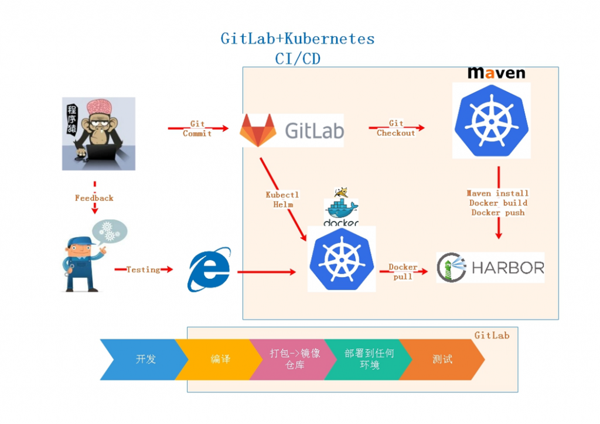

在Kubernetes中，Gitlab Runner，是一个中介的作用，它申请pod运行stage，所以Runner并不直接运行stage。

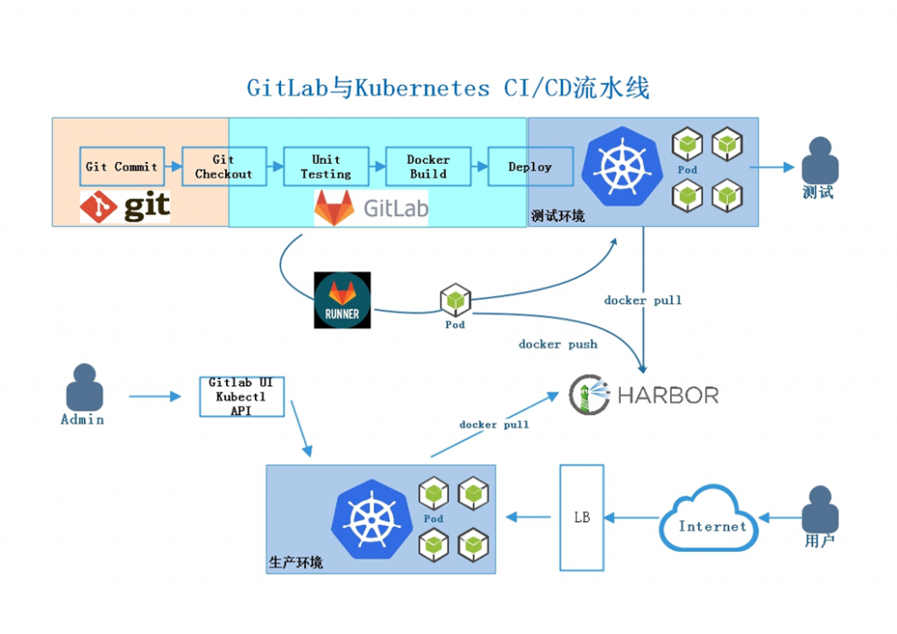

在开始前，需要详细阅读[.gitlab-ci.yml各名词和用法。](https://docs.gitlab.com/ee/ci/yaml/README.html)

## 2\. 环境


Kubernetes version: 1.12


Gitlab version: 11.4.3

## 3\. Kubernetes安装

略

可使用我写的一键安装脚本： [https://github.com/ygqygq2/kubernetes/blob/master/kubeadm/kubeadm\_install\_k8s.sh](https://github.com/ygqygq2/kubernetes/blob/master/kubeadm/kubeadm_install_k8s.sh)

## 4\. GitLab安装

因为已经既然已经用上Kubernetes，那干脆把GitLab也搭建在它上面。 使用helm安装。

1. 添加gitlab的chart地址到helm repo；
2. 下载gitlab的chart；
3. 设置相关values.yaml；
4. helm安装；

gitlab的chart里，模块很多，使用`--set`有的并不好写，所以建议先修改values.yaml（包含各模块的values.yaml）。

这里如果是不使用自带的nginx ingress，推荐修改`gitlab/values.yaml` global.ingress.annotations参数，下面增加 `kubernetes.io/ingress.class: nginx`

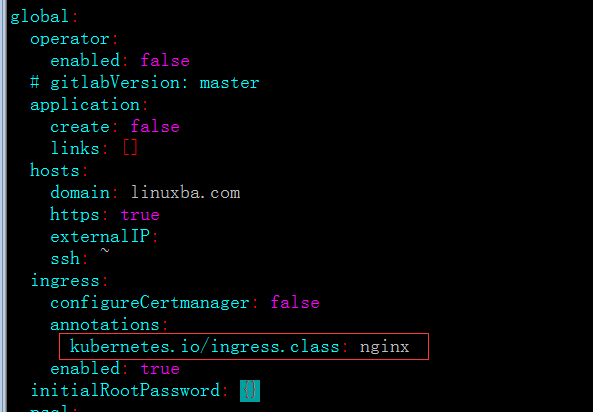

默认它会安装prometheus、certmanager、nginx ingress，按自己需求选择。我的环境已经有nginx ingress、prometheus了，certmanager又暂时没用上。所以这几个都设置为`false`，不安装。如需正式使用，注意持久存储大小。

```bash
helm repo add gitlab https://charts.gitlab.io/
helm fetch gitlab/gitlab --untar
cd gitlab
# vim values.yaml
namespace="devops"
helm upgrade --install gitlab --timeout 600 --namespace $namespace . \
--set gitlab.migrations.image.repository=registry.gitlab.com/gitlab-org/build/cng/gitlab-rails-ce \
--set gitlab.sidekiq.image.repository=registry.gitlab.com/gitlab-org/build/cng/gitlab-sidekiq-ce \
--set gitlab.unicorn.image.repository=registry.gitlab.com/gitlab-org/build/cng/gitlab-unicorn-ce \
--set gitlab.unicorn.workhorse.image=registry.gitlab.com/gitlab-org/build/cng/gitlab-workhorse-ce \
--set gitlab.task-runner.image.repository=registry.gitlab.com/gitlab-org/build/cng/gitlab-task-runner-ce \
--set certmanager-issuer.email=my_email@163.com \
--set global.hosts.domain=linuxba.com \
--set global.smtp.enabled=true \
--set global.smtp.address=smtp.163.com \
--set global.smtp.user_name=my_email@163.com \
--set global.smtp.password.key=password \
--set global.smtp.password.secret=ygqmail \
--set global.time_zone="Asia/Shanghai" \
--set gitlab.gitaly.persistence.storageClass=ceph-rbd \
--set gitlab.gitaly.persistence.size=2Gi \
--set gitlab.gitaly.persistence.storageClass=ceph-rbd \
--set postgresql.persistence.size=2Gi \
--set postgresql.persistence.storageClass=ceph-rbd \
--set minio.persistence.size=5Gi \
--set minio.persistence.storageClass=ceph-rbd \
--set redis.persistence.size=1Gi \
--set redis.persistence.storageClass=ceph-rbd \
--set nginx-ingress.enabled=false \
--set prometheus.install=false \
--set certmanager.install=false \
--set gitlab.gitlab-shell.service.externalPort=20022 \
--set gitlab.gitlab-shell.service.internalPort=20022 \
--set gitlab.gitlab-runner.rbac.clusterWideAccess=true \
--set gitlab.gitlab-runner.rbac.create=true \
--set gitlab.gitlab-runner.runners.privileged=true \
--set glabal.initialRootPassword.key="Git@linuxba.com" \
--set gitlab.migrations.initialRootPassword.key="Git@linuxba.com"

# 自定义runner secret，统一管理
# --set gitlab.gitlab-runner.runners.secret=gitlab-runner-custom

# 上面已经不安装prometheus了，则不申请它的pvc
# --set prometheus.server.persistentVolume.storageClass=ceph-rbd \
# --set prometheus.server.persistentVolume.size=2Gi \
```

安装过程中很容易出现如下提示：

```
E1129 15:21:12.482144 2878016 portforward.go:178] lost connection to pod
Error: UPGRADE FAILED: transport is closing
```

可以等1分钟，查看下pod是否在生成，如果在生成中，则其实已经安装成功。也可以再次使用上面命令，或者使用`helm delete --purge`删除再重新安装。

这也是让人讨厌的helm缺点之一，这篇文章 [恕我直言，对Helm大家还是要三思而后用](https://mp.weixin.qq.com/s?__biz=MzIzNjUxMzk2NQ%3D%3D&idx=1&mid=2247490052&sn=197ae17ce1156e19a279f7695361c532)有提到过。

安装成功后，我发现安装设置的root密码不生效，可以通过以下命令获取登录的root密码： `kubectl get secret -n $namespace gitlab-test-gitlab-initial-root-password -ojsonpath={.data.password}|base64 -d`

`kubectl get ing`可以看到，有3个ingress，访问gitlab.linuxba.com可以访问到gitlab界面。

> 注意： HTTPS访问，因为证书secret关系，可能需要修改ing或者使用事先准备的证书文件生成ing中名称对应的secret。 这些都是k8s细节，这里不作详细描述。

## 5\. Auto DevOps

### 5.1 添加Kubernetes集群

管理员通过服务模板添加Kubernetes集群，是生效所有项目的。

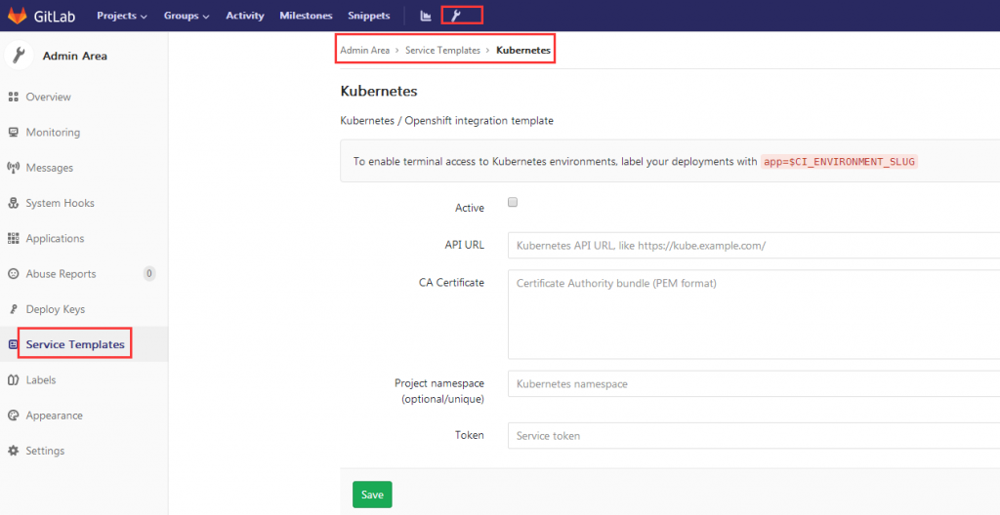

项目中也可以添加Kubernetes集群，优先于管理员添加的全局集群。

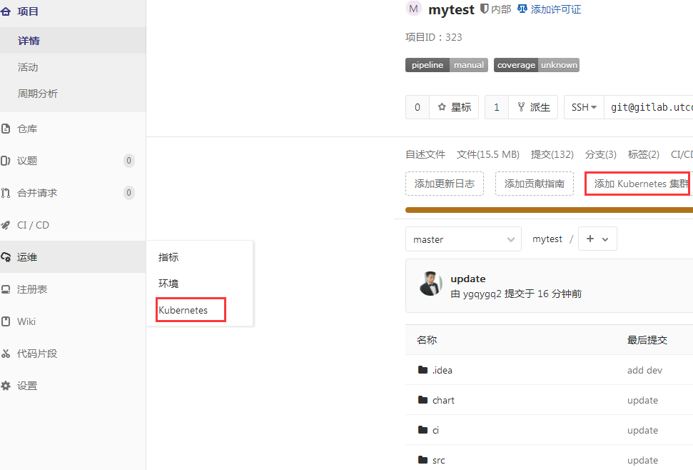

- Active需要勾上；
- 添加集群的API URL即为Kubernetes API地址，因为这里gitlab安装在Kubernetes内，可以使用地址：[https://kubernetes.default](https://kubernetes.default)；
- CA证书，即为Kubernetes的ca证书内容全部复制粘贴；
- 添加集群使用的token和博客《 [为Kubernetes dashboard访问用户添加权限控制](http://blog.51cto.com/ygqygq2/2300960)》中kubeconfig使用的token是一样的，这里不再详细描述；
- Kubernetes namespace，若添加的token的serviceaccount对应的权限为某个namespace，这里需要填写其对应的namespace。默认为空的话，在ci/cd过程中，会自动创建项目的唯一namespace，且只有此namespace的rbac权限。

### 5.2 一个demo

在看demo前，先了解下gitlab中`.gitlab-ci.yml`流水线：

**Stage** GitLab CI/CD 的执行过程中首先驱动的是 Stage。 每个 GitLab CI/CD 都必须包含至少一个 Stage。多个 Stage 是按照顺序执行的。如果其中任何一个 Stage 失败，则后续的 Stage 不会被执行，整个 CI 过程被认为失败。 默认包含三个 Stage：build、test 和deploy。 build 被首先执行。如果发生错误，本次 CI 立刻失败； test 在 build 成功执行完毕后执行。如果发生错误，本次 CI 立刻失败； deploy 在 test 成功执行完毕后执行。如果发生错误，本次 CI 失败。

**Job** Job 包含了真正的执行逻辑，例如调用 mvn 或者 gcc 等命令。

demo项目地址： [https://github.com/ygqygq2/kubernetes-gitlab-autodevops](https://github.com/ygqygq2/kubernetes-gitlab-autodevops) [https://github.com/ygqygq2/kubernetes-gitlab-autodevops/tree/master/mytest](https://github.com/ygqygq2/kubernetes-gitlab-autodevops/tree/master/mytest)

demo是一个maven项目，用到了maven环境的docker image。  
脚本中，设置了`settings.xml`以用于上传image到harbor。  
在`.gitlab-ci.yml`中，各步骤都有注释，已经算是一个完整的流程。  
脚本都是shell，若有用到数组功能，需要在运行的stage的pod基础镜像安装bash，否则出现语法错误，比较误导人。

以下是此demo的流水线过程：

分支流水线：

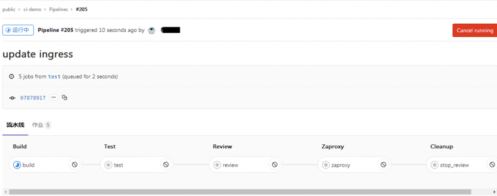

主分支流水线：

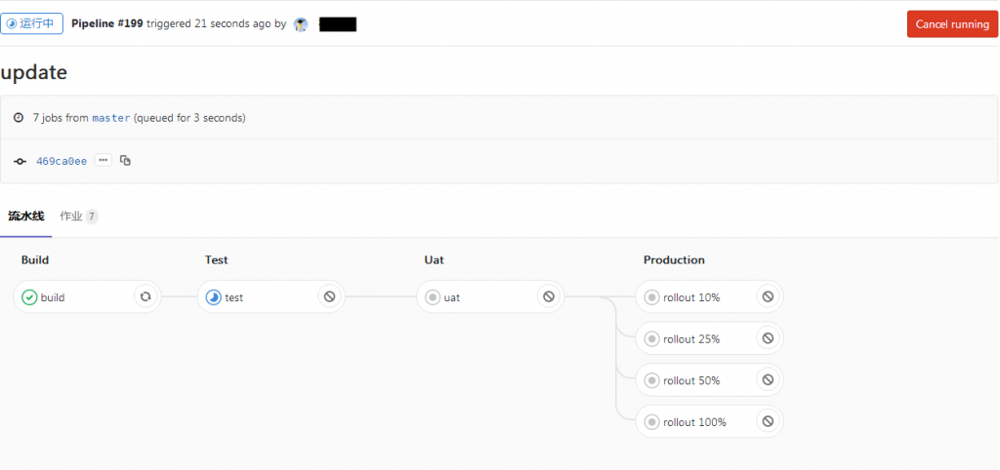

build过程：

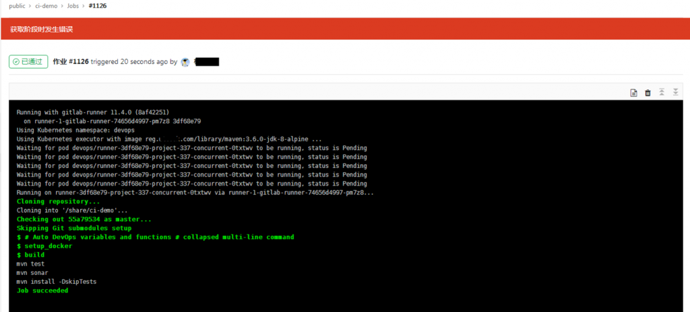

deploy过程：

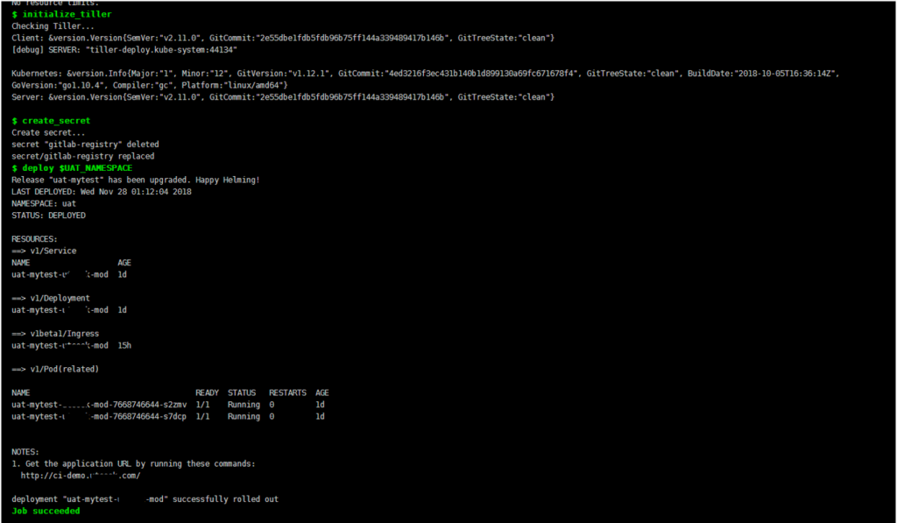

手动运行流水线：

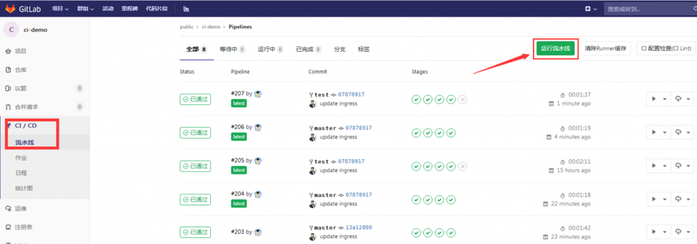 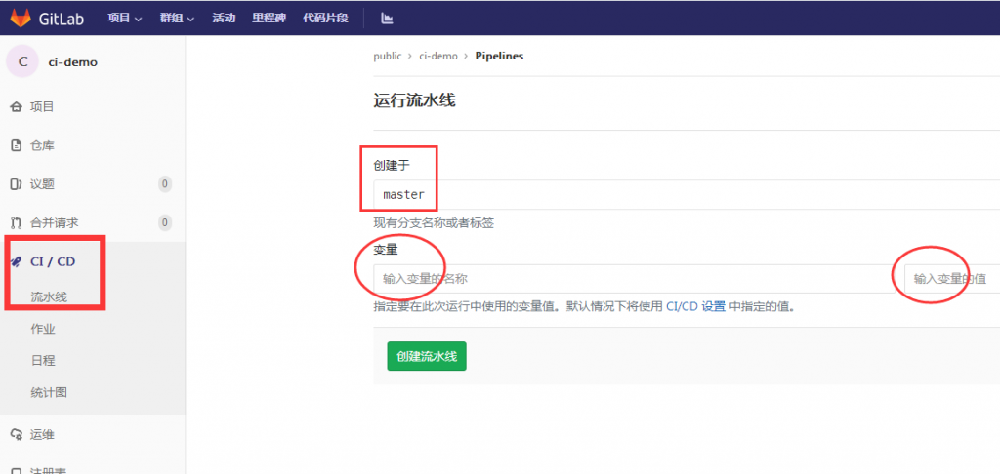

访问相关环境：

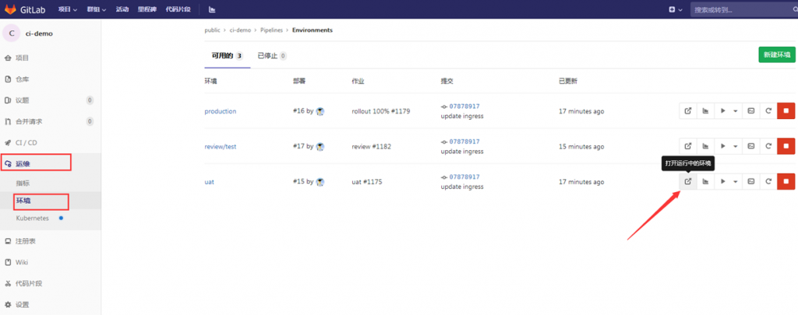

## 6\. 小结

上文没有详细介绍demo，但从流水线图可以看出`.gitlab-ci.yml`的stage，熟悉gitlab的stage和job才能灵活配置CI/CD。建议先从最简单的开始，所有操作使用echo代替，整个流水线跑通了，再细化各job。

参考资料： \[1\] [https://docs.gitlab.com/ee/install/kubernetes/gitlab\_chart.html](https://docs.gitlab.com/ee/install/kubernetes/gitlab_chart.html) \[2\] [https://docs.gitlab.com/ee/user/project/clusters/index.html](https://docs.gitlab.com/ee/user/project/clusters/index.html) \[3\] [https://docs.gitlab.com/ee/topics/autodevops/index.html](https://docs.gitlab.com/ee/topics/autodevops/index.html) \[4\] [https://docs.gitlab.com/ee/ci/variables/](https://docs.gitlab.com/ee/ci/variables/) \[5\] [https://docs.gitlab.com/ee/ci/yaml/README.html](https://docs.gitlab.com/ee/ci/yaml/README.html) \[6\] [https://gitlab.com/gitlab-org/gitlab-ce/blob/master/lib/gitlab/ci/templates/Auto-DevOps.gitlab-ci.yml](https://gitlab.com/gitlab-org/gitlab-ce/blob/master/lib/gitlab/ci/templates/Auto-DevOps.gitlab-ci.yml) \[7\] [http://www.ttlsa.com/auto/gitlab-cicd-gitlab-ci-yml-configuration-tasks-detailed/](http://www.ttlsa.com/auto/gitlab-cicd-gitlab-ci-yml-configuration-tasks-detailed/)
