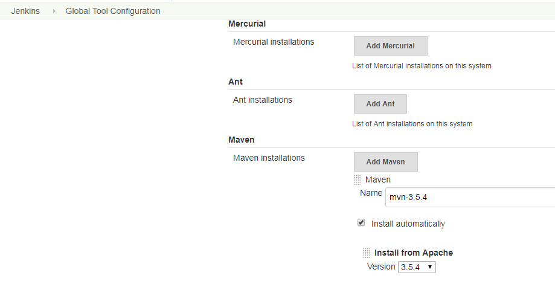
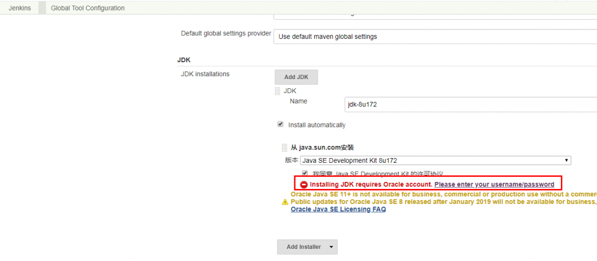
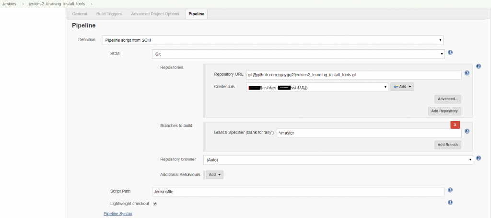
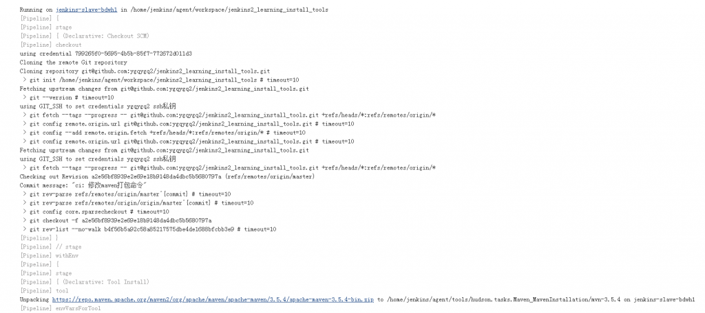

[TOC]

# 1\. Jenkins 2.x 简介

## 1.1 pipeline 是什么

从某种抽象层次上讲，部署流水线（Deployment pipeline）是指从软件版本控制库到用户手中这一过程的自动化表现形式。——《持续交付——发布可靠软件的系统方法》（下称《持续交付》） 按《持续交付》中的定义，Jenkins 本来就支持 pipeline（通常会把部署流水线简称为 pipeline，本书会交替使用这两个术语），只是一开始不叫 pipeline，而叫任务。 Jenkins 1.x 只能通过界面手动操作来“描述”部署流水线。Jenkins 2.x 终于支持 pipeline as code 了，可以通过“代码”来描述部署流水线。 使用“代码”而不是 UI 的意义在于：

- 更好地版本化：将 pipeline 提交到软件版本库中进行版本控制。
- 更好地协作：pipeline 的每次修改对所有人都是可见的。除此之外，还可以对 pipeline 进行代码审查。
- 更好的重用性：手动操作没法重用，但是代码可以重用。 本书全面拥抱 pipeline as code，放弃依赖手动操作的自由风格的项目（FreeStyle project）。

## 1.2 Jenkinsfile 又是什么

Jenkinsfile 就是一个文本文件，也就是部署流水线概念在 Jenkins 中的表现形式。像 Dockerfile 之于 Docker。所有部署流水线的逻辑都写在 Jenkinsfile 中。

## 1.3 pipeline 语法的选择

Jenkins pipeline 有 2 种语法：脚本式（Scripted）语法和声明式（Declar-ative）语法。 脚本式语法使用 Groovy 语言，其语法灵活、可扩展，但是也意味着更复杂。再者，Groovy 语言的学习成本对于（不使用 Groovy 的）开发团队来说通常是不必要的。所以才有了声明式语法，一种提供更简单、更结构化（more opinionated）的语法。

> 1. pipeline 插件从 2.5 版本开始，才同时支持两种格式的语法；
> 2. 推荐主要使用声明式语法，脚本式语法作为辅助；

## 1.4 pipeline 版本控制化

为了便于维护和协作，使用版本仓库对 pipeline 进行版本控制是生产使用过程中的最优选择。 本人实践过程中也是推荐书中提到的使用 Git 作为版本控制仓库，使用 Jenkins ssh 私钥作为凭证。

# 2\. 利用 github 仓库 pipeline 进行构建

以下为本实验地址： [https://github.com/ygqygq2/jenkins2_learning_install_tools](https://github.com/ygqygq2/jenkins2_learning_install_tools)

**目的** 使用 jenkins 拉取 git 仓库内 pipeline 构建 maven 项目，达到了解 pipeline 基本用法。

**环境**

- github 仓库
- jenkins（已整合 kubernetes）

**实践**

1. 进入 Manage Jenkins→Global Tool Configuration->Maven 页添加`mvn-3.5.4` 
2. 进入 Manage Jenkins→Global Tool Configuration→JDK 页添加`jdk-8u172` 

> 注意这里需要 oracle 帐户验证。

1. 添加 pipeline 项目 
2. 构建 

因为 jenkins-slave 是整合 kubernetes 的，因此每次构建都会安装 tools，如上图可以看出，maven 安装包需要从官方下载，这对效率影响非常大。 若想优化可以考虑 jenkins-slave 镜像中直接整合 maven，而不是使用 jenkins tools；还可以使用 docker-in-docker 配合 maven 镜像。
