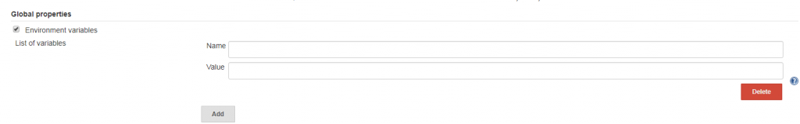
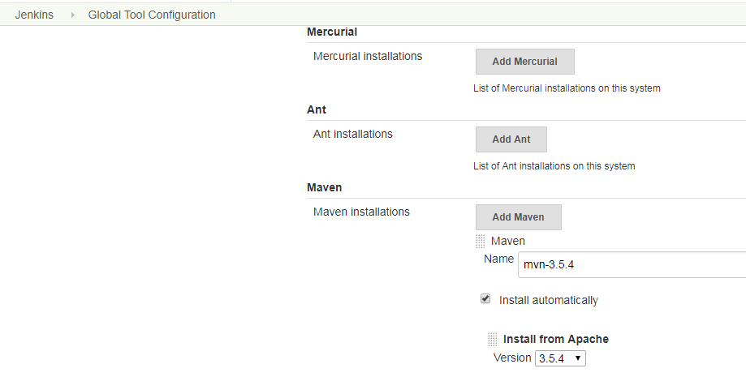
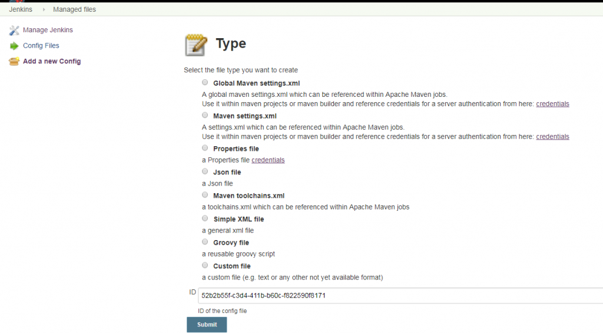
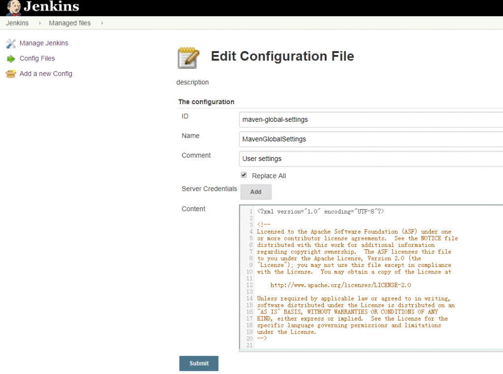
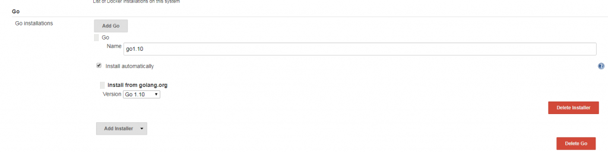

\[TOC\]

# 1\. 环境变量

环境变量可以被看作是pipeline与Jenkins交互的媒介。比如，可以在pipeline中通过BUILD\_NUMBER变量知道构建任务的当前构建次数。环境变量可以分为Jenkins内置变量和自定义变量。

## 1.1 内置变量

在pipeline执行时，Jenkins通过一个名为env的全局变量，将Jenkins内置环境变量暴露出来。其使用方法有多种，示例如下:

```Jenkinsfile
pipeline {
  agent any
  stages {
    stage('Example') {
      steps {
         echo "Running ${env.BUILDNUMBER} on ${env.JENKINS_URL}" # 方法1 推荐
         echo "Running $env.BUILDNUMBER on $env.JENKINS_URL"  # 方法2
         echo "Running ${BUILDNUMBER} on ${JENKINS_URL}"   # 方法3 不推荐，难排查
      }
    }
  }
}
```

通过访问`<Jenkins master的地址>/pipeline-syntax/globals#env`来获取完整列表。在列表中，当一个变量被声明为"For a multibranch project"时，代表只有多分支项目才会有此变量。

下面简单介绍几个在实际工作中经常用到的变量。

- `BUILD_ NUMBER`：构建号，累加的数字。在打包时，它可作为制品名称的一部分，比如`server-2.jar`。
- `BRANCH_ NAME`：多分支pipeline项目支持。当需要根据不同的分支做不同的事情时就会用到，比如通过代码将release分支发布到生产环境中、master分支发布到测试环境中。
- `BUILD_ URL`：当前构建的页面URL。如果构建失败，则需要将失败的构建链接放在邮件通知中，这个链接就可以是`BUILD _URL`。
- `GIT_BRANCH`：通过git拉取的源码构建的项目才会有此变量。

在使用`env`变量时，需要注意不同类型的项目，`env`变量所包含的属性及其值是不一样的。比如普通pipeline任务中的`GIT_BRANCH`变量的值为`origin/master`，而在多分支pipeline任务中`GIT_BRANCH`变量的值为`master`。 所以，在pipeline中根据分支进行不同行为的逻辑处理时，需要留意。

## 1.2 自定义pipeline环境变量

当pipeline变得复杂时，我们就会有定义自己的环境变量的需求。声明式pipeline提供了`environment`指令，方便自定义变量。比如：

```Jenkinsfile
pipeline {
    agent any
    environment {
        CC = "clang"
    }
    stages {
        stage("Example") {
            environment {
                DEBUG_FLAGS = "-g"
            }
            steps {
                sh "${CC} ${DEBUG_FLAGS}"
                sh "printenv"
            }
        }
    }
}
```

`environment`指令可以用在pipeline中定义，作用域就是整个pipeline，当定义在`stage`阶段，只在当前`stage`有效。

但是这些变量都不是跨pipeline的，比如pipeline a访问不到pipeline b的变量。在pipeline之间共享变量可以通过参数化pipeline来实现。

环境变量的互相引用：

```
environment {
    __server_name = 'mail-server'
    __version = "${BUILD_NUMBER}"
    __artifact_name = "${__server_name}-${__version}.jar"
}
```

小技巧 ：

1. 在调试pipeline时，可以在pipeline的开始阶段加一句：`sh 'printenv'`，将`env`变量的属性值打印出来。这样可以帮助我们避免不少问题。
2. 自定义变量时，为避免命名冲突，可根据项目或公司加上统一前缀，如`__server_name`，`__`就是前缀。

## 1.3 自定义全局环境变量

定义全局环境变量可以跨pipeline使用。 进入Jenkins→Manage Jenkins→Confiure System找到Global properties→勾选"Environment variables"复选框，单击“Add”按钮，在输入框中输入变量名和变量值即可。



自定义全局环境变量会被加入`env`属性列表中，所以使用时可以直接用`${env.g_name}`引用。

# 2\. 构建工具

构建是指将源码转换成一个可使用的二进制程序的过程。这个过程可以包括但不限于这几个环节：下载依赖、编译、打包。构建过程的输出——比如一个zip包，我们称之为制品（有些书籍也称之为产出物）。而管理制品的仓库，称为制品库。

## 2.1 构建工具的选择

对构建工具的选择，还取决于团队对工具本身的接受程度。建议是，团队中同一技术栈的所有项目都使用同一个构建工具。

## 2.2 `tools`指令介绍

`tools`指令能帮助我们自动下载并安装所指定的构建工具，并将其加入`PATH`变量中。这样，我们就可以在`sh`步骤里直接使用了。但在`agent none`的情况下不会生效。

`tools`指令默认支持3种工具：JDK、Maven、Gradle。通过安装插件，`tools`指令还可以支持更多的工具。接下来，我们介绍几种常用的构建环境的搭建。

## 2.3 JDK环境搭建

### 2.3.1 自动安装JDK

进入Manage Jenkins→Global Tool Configuration→JDK页，单击“Add JDK”：


> 注意
> 
> 1. 这里需要oracle帐户验证。
> 2. Jenkins不会马上下载JDK，而是当pipeline使用到时才会直接执行下载操作。

### 2.3.2 自定义JDK路径

基于安全的考虑，公司的内网可能无法直接访问因特网或者因为无法访问官方插件地址，所以使用自动下载会失败。这时就需要在Jenkins agent上准备JDK，然后在Manage Jenkins→Global Tool Configuration→JDK页中指定名称和`JAVA_HOME`路径：


> 注意
> 
> 1. 使用docker agent或者kubernetes agent时，可使用agent基础镜像内安装JDK定制成自定义镜像。
> 2. 可以脚本自动化，即在使用`tools`安装JDK前，脚本自动提前准备好这个`JAVA_HOME`的JDK。

## 2.4 Maven

### 2.4.1 使用Maven进行构建

Jenkins pipeline的tools指令默认就支持Maven。所以，使用Maven只需要两步。

1. 进入Manage Jenkins→Global Tool Configuration→Maven页，单击“Add Maven”：



2. 在Jenkinsfile中指定Maven版本，并使用`mvn`命令。

### 2.4.2 使用Managed files设置Maven

Maven默认使用的是其官方仓库，国内下载速度很慢。所以，我们通常会使用国内的Maven镜像仓库。这时就需要修改 Maven 的配置文件 `settings.xml`。`settings.xml` 文件的默认路径为`${M2_HOME}/conf/settings.xml`。但是，我们是不可能登录上Jenkins的机器，然后手动修改这个文件的。 [Config File Provider插件](https://plugins.jenkins.io/config-file-provider)能很好地解决这个问题。只需要在Jenkins的界面上填入`settings.xml`的内容，然后在pipeline中指定`settings.xml`就可以了。也就是说，对于不同的pipeline，可以使用不同的`settings.xml`。 具体实现方法如下：

1. 安装Config File Provider插件。
2. 进入Manage Jenkins页面，就可以看到多出一个“Managed files”菜单。
3. 单击“Managed files”进入，在左侧菜单栏中选择“Add a new Config”，就会看到该插件支持很多种配置文件的格式及方式，



4. 选择“Global Maven settings.xml”选项。因为我们的设置是全局的。填写“ID”字段，Jenkins pipeline会引用此变量名。假如使用的ID为maven-global-settings。
5. 在编辑页将自定义的Maven `settings.xml`的内容粘贴到“Content”字段中，



6. 在Jenkins pipeline中使用的方法如下：

```Jenkinsfile
configFileProvider([configFile(fileId: "maven-global-settings", variable: "MAVEN_GLOBAL_ENV")]) {
    sh "mvn -s $MAVEN_GLOBAL_ENV clean install"
}
```

## 2.5 Go语言环境搭建

Jenkins支持Golang的构建，只需要以下几步。

1. 安装[Go插件](https：//plugins.jenkins.io/golang)。
2. 进入Manage Jenkins→Global Tool Configuration→Go页



3. 在pipeline中加入`tools`部分。

```Jenkinsfile
pipeline {
    agent none
    environment {
        GOPATH = "${env.WORKSPACE}/"
    }
    tools {
        go 'go1.10'
    }    
    stages {
        stage('build') {
            steps {
                sh "go build"
            }
        }
    }
}
```

此时，在环境变量中会增加一个`GOROOT`变量。

4. 设置`GOPATH`。了解Go语言开发的读者都会知道，编译时需要设置`GOPATH`环境变量。直接在`environment`指令中添加就可以了。

## 2.6 Python环境搭建

Python环境很容易产生Python版本冲突、第三方库冲突等问题。所以，Python开发通常会进行工程级别的环境隔离，也就是每个Python工程使用一个Python环境。

在Jenkins环境下，我们使用[Pyenv Pipeline插件](https://plugins.jenkins.io/pyenv-pipeline)可以轻松地实现。 首先，准备Python基础环境。

1. 在Jenkins机器上安装python、pip、virtualenv。
    - pip：Python的包管理工具。
    - virtualenv：Python中的虚拟环境管理工具。
2. 安装Pyenv Pipeline插件。 然后，在pipeline中使用Pyenv Pipeline插件提供的`withPythonEnv`方法。

```
withPythonEnv("/usr/bin/python") {
    sh "python --version"
}
```

`withPythonEnv`方法会根据第一个参数——可执行python路径——在当前工作空间下创建一个virtualenv环境。 `withPythonEnv`方法的第二个参数是一个闭包。闭包内的代码就执行在新建的virtualenv环境下。

# 3\. 利用环境变量支持更多的构建工具

不是所有的构建工具都需要安装相应的Jenkins插件才可以使用。 平时，开发人员在搭建开发环境时做的就是：首先在机器上安装好构建工具，然后将这个构建工具所在目录加入PATH环境变量中。 如果想让Jenkins支持更多的构建工具，也是同样的做法：在Jenkins agent上安装构建工具，并记录下它的可执行命令的目录，然后在需要使用此命令的Jenkins pipeline的PATH环境变量中加入该可执行命令的目录。示例如下：

```Jenkinsfile
pipeline {
    agent none
    environment {
        PATH = "/usr/local/customtool/bin:$PATH"
    }
    stages {
        stage('build') {
            steps {
                sh "customtool build"
            }
        }
    }
}
```

还可以有另一种写法：

```Jenkinsfile
pipeline {
    agent none
    environment {
        CUSTOM_TOOL_HOME = "/usr/local/customtool/bin"
    }
    stages {
        stage('build') {
            steps {
                sh "${CUSTOM_TOOL_HOME}/customtool build"
            }
        }
    }
}
```

# 4\. 利用tools作用域实现多版本编译

在实际工作中，有时需要对同一份源码使用多个版本的编译器进行编译。`tools`指令除了支持pipeline作用域，还支持`stage`作用域。所以，我们可以在同一个pipeline中实现多版本编译。代码如下：

```
pipeline {
    agent none
    stages {
        stage('build with jdk-10.0.2') {
            tools {
                jdk "jdk-10.0.2"
            }
            steps {
                sh "printenv"
            }
        }
        stage('build with jdk-9.0.4') {
            tools {
                jdk "jdk-9.0.4"
            }
            steps {
                sh "printenv"
            }
        }       
    }
}
```

在打印出来的日志中，会发现每个stage下的`JAVA_HOME`变量的值都不一样。

参考资料： \[1\] 《Jenkins 2.x实战指南》 \[2\] [https://jenkins.io/zh/doc/book/pipeline/syntax/](https://jenkins.io/zh/doc/book/pipeline/syntax/) \[3\] [https://jenkins.io/zh/doc/pipeline/steps/](https://jenkins.io/zh/doc/pipeline/steps/)
