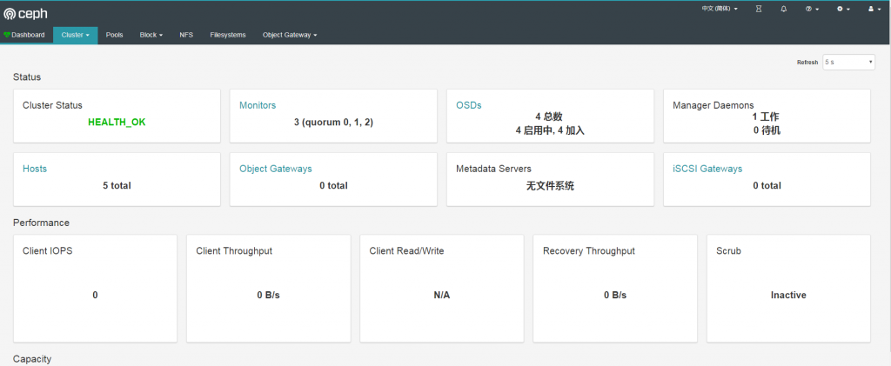
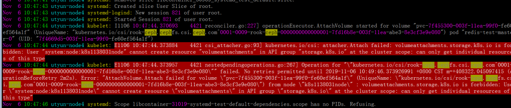
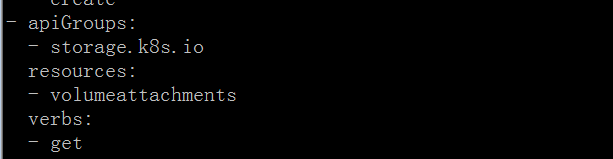

[TOC]

# 1\. 简单说说为什么用 rook

[rook](https://rook.io/)这里就不作详细介绍了，具体可以到官网查看。

说说为什么要在 kubernetes 上使用 rook 部署 ceph 集群。 众所周知，当前[kubernetes](https://kubernetes.io)为当前最佳云原生容器平台，随着 pod 在 kubernetes 节点内被释放，其容器数据也会被清除，即没有持久化存储数据能力。而[ceph](https://ceph.com)作为最好的开源存储之一，也是结合 kubernetes 最好的存储之一。利用 kubernetes 的调度功能，rook 的自我扩展和自我修复能力，相互紧密配合。

# 2\. rook-ceph 部署

## 2.1 环境

|            | 版本             | 备注                              |
| ---------- | ---------------- | --------------------------------- |
| 系统       | CentOS7.6        | 一块 200G 数据盘                  |
| kubernetes | v1.14.8-aliyun.1 | 有挂载数据盘的节点调度为 osd 节点 |
| rook       | v1.1.4           | \-                                |
| ceph       | v14.2.4          | \-                                |

> 注： OSD 至少 3 个节点，直接使用裸盘而不使用分区或者文件系统的方式性能最好。

## 2.2 Rook Operator 部署

这里我们使用 helm 方式，helm 的优势不必多说。

参考文档： [https://rook.io/docs/rook/v1.1/helm-operator.html](https://rook.io/docs/rook/v1.1/helm-operator.html)

```bash
helm repo add rook-release https://charts.rook.io/release
helm fetch --untar rook-release/rook-ceph
cd rook-ceph
vim values.yaml  # 默认镜像被FW挡了，推荐 repository: ygqygq2/hyperkube
helm install --name rook-ceph --namespace rook-ceph --namespace ./
```

> 注： 根据 kubernetes 版本支持，可将`values.yaml`中设置`enableFlexDriver: true`；

部署结果：

```
[root@linuxba-node1 rook-ceph]#          kubectl get pod -n rook-ceph
NAME                                  READY   STATUS    RESTARTS   AGE
rook-ceph-operator-5bd7d67784-k9bq9   1/1     Running   0          2d15h
rook-discover-2f84s                   1/1     Running   0          2d14h
rook-discover-j9xjk                   1/1     Running   0          2d14h
rook-discover-nvnwn                   1/1     Running   0          2d14h
rook-discover-nx4qf                   1/1     Running   0          2d14h
rook-discover-wm6wp                   1/1     Running   0          2d14h
```

## 2.3 Ceph 集群创建

### 2.3.1 标识 osd 节点

为了更好的管理控制 osd，标识指定节点，便于 pod 只在这些节点调度。

```bash
kubectl label node node1 ceph-role=osd
```

### 2.3.2 yaml 创建 Ceph 集群

`vim rook-ceph-cluster.yaml`

```yaml
apiVersion: ceph.rook.io/v1
kind: CephCluster
metadata:
  name: rook-ceph
  namespace: rook-ceph
spec:
  cephVersion:
    image: ceph/ceph:v14.2.4-20190917
  # 节点ceph目录,包含配置和log
  dataDirHostPath: /var/lib/rook
  mon:
    # Set the number of mons to be started. The number should be odd and between 1 and 9.
    # If not specified the default is set to 3 and allowMultiplePerNode is also set to true.
    count: 3
    # Enable (true) or disable (false) the placement of multiple mons on one node. Default is false.
    allowMultiplePerNode: false
  mgr:
    modules:
      - name: pg_autoscaler
        enabled: true
  network:
    # osd和mgr会使用主机网络，但是mon还是使用k8s网络，因此仍不能解决k8s外部连接问题
    # hostNetwork: true
  dashboard:
    enabled: true
  # cluster level storage configuration and selection
  storage:
    useAllNodes: false
    useAllDevices: false
    deviceFilter:
    location:
    config:
      metadataDevice:
      #databaseSizeMB: "1024" # this value can be removed for environments with normal sized disks (100 GB or larger)
      #journalSizeMB: "1024"  # this value can be removed for environments with normal sized disks (20 GB or larger)
    # 节点列表,使用k8s中节点名
    nodes:
      - name: k8s1138026node
        devices: # specific devices to use for storage can be specified for each node
          - name: "vdb"
        config: # configuration can be specified at the node level which overrides the cluster level config
          storeType: bluestore
      - name: k8s1138027node
        devices: # specific devices to use for storage can be specified for each node
          - name: "vdb"
        config: # configuration can be specified at the node level which overrides the cluster level config
          storeType: bluestore
      - name: k8s1138031node
        devices: # specific devices to use for storage can be specified for each node
          - name: "vdb"
        config: # configuration can be specified at the node level which overrides the cluster level config
          storeType: bluestore
      - name: k8s1138032node
        devices: # specific devices to use for storage can be specified for each node
          - name: "vdb"
        config: # configuration can be specified at the node level which overrides the cluster level config
          storeType: bluestore
  placement:
    all:
      nodeAffinity:
      tolerations:
    mgr:
      nodeAffinity:
      tolerations:
    mon:
      nodeAffinity:
      tolerations:
    # 建议osd设置节点亲合性
    osd:
      nodeAffinity:
        requiredDuringSchedulingIgnoredDuringExecution:
          nodeSelectorTerms:
            - matchExpressions:
                - key: ceph-role
                  operator: In
                  values:
                    - osd
      tolerations:
```

```bash
kubectl apply -f rook-ceph-cluster.yaml
```

查看结果：

```
[root@linuxba-node1 ceph]# kubectl get pod -n rook-ceph -owide
NAME                                            READY   STATUS      RESTARTS   AGE   IP              NODE             NOMINATED NODE   READINESS GATES
csi-cephfsplugin-5dthf                          3/3     Running     0          20h   172.16.138.33   k8s1138033node   <none>           <none>
csi-cephfsplugin-f2hwm                          3/3     Running     3          20h   172.16.138.27   k8s1138027node   <none>           <none>
csi-cephfsplugin-hggkk                          3/3     Running     0          20h   172.16.138.26   k8s1138026node   <none>           <none>
csi-cephfsplugin-pjh66                          3/3     Running     0          20h   172.16.138.32   k8s1138032node   <none>           <none>
csi-cephfsplugin-provisioner-78d9994b5d-9n4n7   4/4     Running     0          20h   10.244.2.80     k8s1138031node   <none>           <none>
csi-cephfsplugin-provisioner-78d9994b5d-tc898   4/4     Running     0          20h   10.244.3.81     k8s1138032node   <none>           <none>
csi-cephfsplugin-tgxsk                          3/3     Running     0          20h   172.16.138.31   k8s1138031node   <none>           <none>
csi-rbdplugin-22bp9                             3/3     Running     0          20h   172.16.138.26   k8s1138026node   <none>           <none>
csi-rbdplugin-hf44c                             3/3     Running     0          20h   172.16.138.32   k8s1138032node   <none>           <none>
csi-rbdplugin-hpx7f                             3/3     Running     0          20h   172.16.138.33   k8s1138033node   <none>           <none>
csi-rbdplugin-kvx7x                             3/3     Running     3          20h   172.16.138.27   k8s1138027node   <none>           <none>
csi-rbdplugin-provisioner-74d6966958-srvqs      5/5     Running     5          20h   10.244.1.111    k8s1138027node   <none>           <none>
csi-rbdplugin-provisioner-74d6966958-vwmms      5/5     Running     0          20h   10.244.3.80     k8s1138032node   <none>           <none>
csi-rbdplugin-tqt7b                             3/3     Running     0          20h   172.16.138.31   k8s1138031node   <none>           <none>
rook-ceph-mgr-a-855bf6985b-57vwp                1/1     Running     1          19h   10.244.1.108    k8s1138027node   <none>           <none>
rook-ceph-mon-a-7894d78d65-2zqwq                1/1     Running     1          19h   10.244.1.110    k8s1138027node   <none>           <none>
rook-ceph-mon-b-5bfc85976c-q5gdk                1/1     Running     0          19h   10.244.4.178    k8s1138033node   <none>           <none>
rook-ceph-mon-c-7576dc5fbb-kj8rv                1/1     Running     0          19h   10.244.2.104    k8s1138031node   <none>           <none>
rook-ceph-operator-5bd7d67784-5l5ss             1/1     Running     0          24h   10.244.2.13     k8s1138031node   <none>           <none>
rook-ceph-osd-0-d9c5686c7-tfjh9                 1/1     Running     0          19h   10.244.0.35     k8s1138026node   <none>           <none>
rook-ceph-osd-1-9987ddd44-9hwvg                 1/1     Running     0          19h   10.244.2.114    k8s1138031node   <none>           <none>
rook-ceph-osd-2-f5df47f59-4zd8j                 1/1     Running     1          19h   10.244.1.109    k8s1138027node   <none>           <none>
rook-ceph-osd-3-5b7579d7dd-nfvgl                1/1     Running     0          19h   10.244.3.90     k8s1138032node   <none>           <none>
rook-ceph-osd-prepare-k8s1138026node-cmk5j      0/1     Completed   0          19h   10.244.0.36     k8s1138026node   <none>           <none>
rook-ceph-osd-prepare-k8s1138027node-nbm82      0/1     Completed   0          19h   10.244.1.103    k8s1138027node   <none>           <none>
rook-ceph-osd-prepare-k8s1138031node-9gh87      0/1     Completed   0          19h   10.244.2.115    k8s1138031node   <none>           <none>
rook-ceph-osd-prepare-k8s1138032node-nj7vm      0/1     Completed   0          19h   10.244.3.87     k8s1138032node   <none>           <none>
rook-discover-4n25t                             1/1     Running     0          25h   10.244.2.5      k8s1138031node   <none>           <none>
rook-discover-76h87                             1/1     Running     0          25h   10.244.0.25     k8s1138026node   <none>           <none>
rook-discover-ghgnk                             1/1     Running     0          25h   10.244.4.5      k8s1138033node   <none>           <none>
rook-discover-slvx8                             1/1     Running     0          25h   10.244.3.5      k8s1138032node   <none>           <none>
rook-discover-tgb8v                             0/1     Error       0          25h   <none>          k8s1138027node   <none>           <none>
[root@linuxba-node1 ceph]# kubectl get svc,ep -n rook-ceph
NAME                               TYPE        CLUSTER-IP      EXTERNAL-IP   PORT(S)             AGE
service/csi-cephfsplugin-metrics   ClusterIP   10.96.36.5      <none>        8080/TCP,8081/TCP   20h
service/csi-rbdplugin-metrics      ClusterIP   10.96.252.208   <none>        8080/TCP,8081/TCP   20h
service/rook-ceph-mgr              ClusterIP   10.96.167.186   <none>        9283/TCP            19h
service/rook-ceph-mgr-dashboard    ClusterIP   10.96.148.18    <none>        7000/TCP            19h
service/rook-ceph-mon-a            ClusterIP   10.96.183.92    <none>        6789/TCP,3300/TCP   19h
service/rook-ceph-mon-b            ClusterIP   10.96.201.107   <none>        6789/TCP,3300/TCP   19h
service/rook-ceph-mon-c            ClusterIP   10.96.105.92    <none>        6789/TCP,3300/TCP   19h

NAME                                 ENDPOINTS                                                            AGE
endpoints/ceph.rook.io-block         <none>                                                               25h
endpoints/csi-cephfsplugin-metrics   10.244.2.80:9081,10.244.3.81:9081,172.16.138.26:9081 + 11 more...    20h
endpoints/csi-rbdplugin-metrics      10.244.1.111:9090,10.244.3.80:9090,172.16.138.26:9090 + 11 more...   20h
endpoints/rook-ceph-mgr              10.244.1.108:9283                                                    19h
endpoints/rook-ceph-mgr-dashboard    10.244.1.108:7000                                                    19h
endpoints/rook-ceph-mon-a            10.244.1.110:3300,10.244.1.110:6789                                  19h
endpoints/rook-ceph-mon-b            10.244.4.178:3300,10.244.4.178:6789                                  19h
endpoints/rook-ceph-mon-c            10.244.2.104:3300,10.244.2.104:6789                                  19h
endpoints/rook.io-block              <none>                                                               25h
```

## 2.4 Rook toolbox 验证 ceph

将 Rook toolbox 部署至 kubernetes 中，以下为部署 yaml：

`vim rook-ceph-toolbox.yam`

```yaml
apiVersion: apps/v1
kind: Deployment
metadata:
  name: rook-ceph-tools
  namespace: rook-ceph
  labels:
    app: rook-ceph-tools
spec:
  replicas: 1
  selector:
    matchLabels:
      app: rook-ceph-tools
  template:
    metadata:
      labels:
        app: rook-ceph-tools
    spec:
      dnsPolicy: ClusterFirstWithHostNet
      containers:
        - name: rook-ceph-tools
          image: rook/ceph:v1.1.0
          command: ["/tini"]
          args: ["-g", "--", "/usr/local/bin/toolbox.sh"]
          imagePullPolicy: IfNotPresent
          env:
            - name: ROOK_ADMIN_SECRET
              valueFrom:
                secretKeyRef:
                  name: rook-ceph-mon
                  key: admin-secret
          securityContext:
            privileged: true
          volumeMounts:
            - mountPath: /dev
              name: dev
            - mountPath: /sys/bus
              name: sysbus
            - mountPath: /lib/modules
              name: libmodules
            - name: mon-endpoint-volume
              mountPath: /etc/rook
      # if hostNetwork: false, the "rbd map" command hangs, see https://github.com/rook/rook/issues/2021
      hostNetwork: true
      volumes:
        - name: dev
          hostPath:
            path: /dev
        - name: sysbus
          hostPath:
            path: /sys/bus
        - name: libmodules
          hostPath:
            path: /lib/modules
        - name: mon-endpoint-volume
          configMap:
            name: rook-ceph-mon-endpoints
            items:
              - key: data
                path: mon-endpoints
```

```bash
# 启动rook-ceph-tools pod
kubectl create -f rook-ceph-toolbox.yaml

# 等待toolbox pod启动完成
kubectl -n rook-ceph get pod -l "app=rook-ceph-tools"

# toolbox运行后，可进入
kubectl -n rook-ceph exec -it $(kubectl -n rook-ceph get pod -l "app=rook-ceph-tools" -o jsonpath='{.items[0].metadata.name}') bash
```

进入 toolbox 后查看 ceph 相关状态：

```
# 使用ceph命令查看状态
[root@linuxba-node5 /]# ceph -s
  cluster:
    id:     f3457013-139d-4dae-b380-fe86dc05dfaa
    health: HEALTH_OK

  services:
    mon: 3 daemons, quorum a,b,c (age 21h)
    mgr: a(active, since 21h)
    osd: 4 osds: 4 up (since 21h), 4 in (since 22h)

  data:
    pools:   0 pools, 0 pgs
    objects: 0 objects, 0 B
    usage:   4.0 GiB used, 792 GiB / 796 GiB avail
    pgs:

[root@linuxba-node5 /]# ceph osd status
+----+----------------+-------+-------+--------+---------+--------+---------+-----------+
| id |      host      |  used | avail | wr ops | wr data | rd ops | rd data |   state   |
+----+----------------+-------+-------+--------+---------+--------+---------+-----------+
| 0  | k8s1138026node | 1026M |  197G |    0   |     0   |    0   |     0   | exists,up |
| 1  | k8s1138031node | 1026M |  197G |    0   |     0   |    0   |     0   | exists,up |
| 2  | k8s1138027node | 1026M |  197G |    0   |     0   |    0   |     0   | exists,up |
| 3  | k8s1138032node | 1026M |  197G |    0   |     0   |    0   |     0   | exists,up |
+----+----------------+-------+-------+--------+---------+--------+---------+-----------+
[root@linuxba-node5 /]# ceph df
RAW STORAGE:
    CLASS     SIZE        AVAIL       USED       RAW USED     %RAW USED
    hdd       796 GiB     792 GiB     10 MiB      4.0 GiB          0.50
    TOTAL     796 GiB     792 GiB     10 MiB      4.0 GiB          0.50

POOLS:
    POOL     ID     STORED     OBJECTS     USED     %USED     MAX AVAIL
[root@linuxba-node5 /]# rados df
POOL_NAME USED OBJECTS CLONES COPIES MISSING_ON_PRIMARY UNFOUND DEGRADED RD_OPS RD WR_OPS WR USED COMPR UNDER COMPR

total_objects    0
total_used       4.0 GiB
total_avail      792 GiB
total_space      796 GiB
[root@linuxba-node5 /]#
```

> 注： 自定义 configmap `rook-config-override`中的`config`，会自动挂载到 ceph pod 中为`/etc/ceph/ceph.conf`，达到自定义配置目的。（推荐使用 Ceph Cli 管理，而不推荐这种方式）

```yaml
apiVersion: v1
kind: ConfigMap
metadata:
  name: rook-config-override
  namespace: rook-ceph
data:
  config: |
    [global]
    osd crush update on start = false
    osd pool default size = 2
```

## 2.5 暴露 Ceph

ceph 部署在 kubernetes 中，需要被外面访问，则需要暴露相关服务，比如 dashboard、ceph monitor。

### 2.5.1 暴露 ceph dashboard

推荐使用 ingress 方式暴露 dashboard，其它方式参考 kubernetes 相关用法。

`vim rook-ceph-dashboard-ingress.yaml`

```yaml
apiVersion: extensions/v1beta1
kind: Ingress
metadata:
  annotations:
    # cert-manager.io/cluster-issuer: letsencrypt-prod
    # kubernetes.io/tls-acme: "true"
  name: rook-ceph-mgr-dashboard
  namespace: rook-ceph
spec:
  rules:
    - host: ceph-dashboard.linuxba.com
      http:
        paths:
          - backend:
              serviceName: rook-ceph-mgr-dashboard
              servicePort: 7000
            path: /
  tls:
    - hosts:
        - ceph-dashboard.linuxba.com
      secretName: tls-ceph-dashboard-linuxba-com
```

获取 dashboard 密码：

```bash
kubectl -n rook-ceph get secret rook-ceph-dashboard-password -o jsonpath="{['data']['password']}" | base64 --decode && echo
```

用户名为`admin`，登录后：



### 2.5.2 暴露 ceph monitor

这步只为验证 kubernetes 外部能否连接 ceph monitor，而结果表明，确实不行。

新创建 monitor 的 service，service type 为`LoadBalancer`，以便 k8s 外部能使用，因为我使用的是阿里云 kubernetes，而我又只想使用内网负载均衡，因此还要添加以下 service：

`vim rook-ceph-mon-svc.yaml`

```yaml
apiVersion: v1
kind: Service
metadata:
  annotations:
    service.beta.kubernetes.io/alibaba-cloud-loadbalancer-address-type: "intranet"
  labels:
    app: rook-ceph-mon
    mon_cluster: rook-ceph
    rook_cluster: rook-ceph
  name: rook-ceph-mon
  namespace: rook-ceph
spec:
  ports:
    - name: msgr1
      port: 6789
      protocol: TCP
      targetPort: 6789
    - name: msgr2
      port: 3300
      protocol: TCP
      targetPort: 3300
  selector:
    app: rook-ceph-mon
    mon_cluster: rook-ceph
    rook_cluster: rook-ceph
  sessionAffinity: None
  type: LoadBalancer
```

> 注： 1. 自建 kubernetes 推荐 MetalLB 提供 LoadBalancer 方式负载均衡。 2. 现在 rook 并不支持 kubernetes 外部连接 ceph monitor。

# 3\. 配置 rook-ceph

配置 ceph，达到 kubernetes 能使用动态卷管理。

`vim rook-ceph-block-pool.yaml`

```yaml
apiVersion: ceph.rook.io/v1
kind: CephBlockPool
metadata:
  name: replicapool
  namespace: rook-ceph
spec:
  failureDomain: host
  replicated:
    size: 2
  # Sets up the CRUSH rule for the pool to distribute data only on the specified device class.
  # If left empty or unspecified, the pool will use the cluster’s default CRUSH root, which usually distributes data over all OSDs, regardless of their class.
  # deviceClass: hdd
```

`vim rook-ceph-filesystem.yaml`

```yaml
apiVersion: ceph.rook.io/v1
kind: CephFilesystem
metadata:
  name: cephfs-k8s
  namespace: rook-ceph
spec:
  metadataPool:
    replicated:
      size: 3
  dataPools:
    - replicated:
        size: 3
  metadataServer:
    activeCount: 1
    activeStandby: true
```

`vim rook-ceph-storage-class.yaml`

```yaml
apiVersion: storage.k8s.io/v1
kind: StorageClass
metadata:
  name: ceph-rbd
provisioner: ceph.rook.io/block
parameters:
  blockPool: replicapool
  # The value of "clusterNamespace" MUST be the same as the one in which your rook cluster exist
  clusterNamespace: rook-ceph
  # Specify the filesystem type of the volume. If not specified, it will use ext4.
  fstype: xfs
# Optional, default reclaimPolicy is "Delete". Other options are: "Retain", "Recycle" as documented in https://kubernetes.io/docs/concepts/storage/storage-classes/
reclaimPolicy: Retain
# Optional, if you want to add dynamic resize for PVC. Works for Kubernetes 1.14+
# For now only ext3, ext4, xfs resize support provided, like in Kubernetes itself.
allowVolumeExpansion: true
---
# apiVersion: storage.k8s.io/v1
# kind: StorageClass
# metadata:
#   name: cephfs
# # Change "rook-ceph" provisioner prefix to match the operator namespace if needed
# provisioner: rook-ceph.cephfs.csi.ceph.com
# parameters:
#   # clusterID is the namespace where operator is deployed.
#   clusterID: rook-ceph
#
#   # CephFS filesystem name into which the volume shall be created
#   fsName: cephfs-k8s
#
#   # Ceph pool into which the volume shall be created
#   # Required for provisionVolume: "true"
#   pool: cephfs-k8s-data0
#
#   # Root path of an existing CephFS volume
#   # Required for provisionVolume: "false"
#   # rootPath: /absolute/path
#
#   # The secrets contain Ceph admin credentials. These are generated automatically by the operator
#   # in the same namespace as the cluster.
#   csi.storage.k8s.io/provisioner-secret-name: rook-csi-cephfs-provisioner
#   csi.storage.k8s.io/provisioner-secret-namespace: rook-ceph
#   csi.storage.k8s.io/node-stage-secret-name: rook-csi-cephfs-node
#   csi.storage.k8s.io/node-stage-secret-namespace: rook-ceph
#
# reclaimPolicy: Retain
```

进入 toolbox 查看结果：

```yaml
[root@linuxba-node5 /]# ceph osd pool ls
replicapool
cephfs-k8s-metadata
cephfs-k8s-data0
[root@linuxba-node5 /]# ceph fs ls
name: cephfs-k8s, metadata pool: cephfs-k8s-metadata, data pools: [cephfs-k8s-data0 ]
[root@linuxba-node5 /]#
```

# 4\. kubernetes 使用动态卷验证 ceph

成功验证 flex 的 ceph rbd。

```
[root@linuxba-node1 ceph]# kubectl get pod
NAME                            READY   STATUS    RESTARTS   AGE
curl-66bdcf564-9hhrt            1/1     Running   0          23h
curl-66bdcf564-ghq5s            1/1     Running   0          23h
curl-66bdcf564-sbv8b            1/1     Running   1          23h
curl-66bdcf564-t9gnc            1/1     Running   0          23h
curl-66bdcf564-v5kfx            1/1     Running   0          23h
nginx-rbd-dy-67d8bbfcb6-vnctl   1/1     Running   0          21s
[root@linuxba-node1 ceph]# kubectl exec -it nginx-rbd-dy-67d8bbfcb6-vnctl /bin/bash
root@nginx-rbd-dy-67d8bbfcb6-vnctl:/# ps -ef
bash: ps: command not found
root@nginx-rbd-dy-67d8bbfcb6-vnctl:/# df -h
Filesystem      Size  Used Avail Use% Mounted on
overlay         197G  9.7G  179G   6% /
tmpfs            64M     0   64M   0% /dev
tmpfs            32G     0   32G   0% /sys/fs/cgroup
/dev/vda1       197G  9.7G  179G   6% /etc/hosts
shm              64M     0   64M   0% /dev/shm
/dev/rbd0      1014M   33M  982M   4% /usr/share/nginx/html
tmpfs            32G   12K   32G   1% /run/secrets/kubernetes.io/serviceaccount
tmpfs            32G     0   32G   0% /proc/acpi
tmpfs            32G     0   32G   0% /proc/scsi
tmpfs            32G     0   32G   0% /sys/firmware
root@nginx-rbd-dy-67d8bbfcb6-vnctl:/# cd /usr/share/nginx/html/
root@nginx-rbd-dy-67d8bbfcb6-vnctl:/usr/share/nginx/html# ls
root@nginx-rbd-dy-67d8bbfcb6-vnctl:/usr/share/nginx/html# ls -la
total 4
drwxr-xr-x 2 root root    6 Nov  5 08:47 .
drwxr-xr-x 3 root root 4096 Oct 23 00:25 ..
root@nginx-rbd-dy-67d8bbfcb6-vnctl:/usr/share/nginx/html# echo a > test.html
root@nginx-rbd-dy-67d8bbfcb6-vnctl:/usr/share/nginx/html# ls -l
total 4
-rw-r--r-- 1 root root 2 Nov  5 08:47 test.html
root@nginx-rbd-dy-67d8bbfcb6-vnctl:/usr/share/nginx/html#
```

而 cephfs 验证失败，pod 一直处于等待挂载中，下文作详细说明。

# 5\. 解决 rook-ceph 的 csi-cephfs 不能在 flex 的阿里云 kubernetes 上挂载问题

查看到使用 cephfs pvc 的 pod 所有节点的`/var/log/message`日志，



按日志提示，开始以为是权限不足：

`kubectl get clusterrole system:node -oyaml`



通过添加这个 clusterrole 的权限，报错仍旧一样。

才想起，创建 cephfs storageclass 时使用的是 csi 插件方式的。 而阿里云 kubernetes 只支持 flex 或者 csi，我的集群选择的是使用 flex 插件方式的。

其 flex 插件方式下，集群节点 kubelet 参数，`enable-controller-attach-detach`为`false`。 若需要修改成 csi 方式，需要自行修改此参数为`true`。

说干就干，进到 ContainerCreating 状态的 pod 所在节点，

`vim /etc/systemd/system/kubelet.service.d/10-kubeadm.conf`，修改`enable-controller-attach-detach`为`true`，然后`systemctl daemon-reload && systemctl restart kubelet`重启 kubelet，结果发现 POD 已正常挂载了。

可以得出结论，确实是阿里云 kubernetes 的 kubelet 参数`enable-controller-attach-detach`为`false`导致不能使用 csi。

修改这个参数显然是不现实的，因为在购买阿里云托管版 kubernetes 时已经选择了 flex 插件方式，本来不需要维护 kubelet，现在因为这个参数要维护所有节点的 kubelet。那不修改 kubelet 参数，又有什么其它办法解决呢？ 以前我用的是`kubernetes-incubator/external-storage/ceph`方式提供的 provisioner，参考我以前的文章： [https://blog.51cto.com/ygqygq2/2163656](https://blog.51cto.com/ygqygq2/2163656)

## 5.1 创建 cephfs-provisioner

首先，将 toolbox 里的`/etc/ceph/keyring`内 key 后面的字符串，写到文件`/tmp/ceph.client.admin.secret`，做成 secret，并启动 cephfs-provisioner。

```bash
kubectl create secret generic ceph-admin-secret --from-file=/tmp/ceph.client.admin.secret  --namespace=rook-ceph
kubectl apply -f cephfs/rbac/
```

等待启动成功

```
[root@linuxba-node1 ceph]# kubectl get pod -n rook-ceph|grep cephfs-provisioner
cephfs-provisioner-5f64bb484b-24bqf             1/1     Running     0          2m
```

然后创建 cephfs storageclass。 `vim cephfs-storageclass.yaml`

```
kind: StorageClass
apiVersion: storage.k8s.io/v1
metadata:
  name: cephfs
provisioner: ceph.com/cephfs
reclaimPolicy: Retain
parameters:
  # ceph monitor的svc IP 端口
  monitors: 10.96.201.107:6789,10.96.105.92:6789,10.96.183.92:6789
  adminId: admin
  adminSecretName: ceph-admin-secret
  adminSecretNamespace: "rook-ceph"
  claimRoot: /volumes/kubernetes
```

kubernetes 节点还是要安装 ceph-common 和 ceph-fuse。

使用阿里云的 ceph yum 源，`cat /etc/yum.repos.d/ceph.repo`

```
[Ceph]
name=Ceph packages for $basearch
baseurl=http://mirrors.cloud.aliyuncs.com/ceph/rpm-nautilus/el7/$basearch
enabled=1
gpgcheck=1
type=rpm-md
gpgkey=http://mirrors.cloud.aliyuncs.com/ceph/keys/release.asc

[Ceph-noarch]
name=Ceph noarch packages
baseurl=http://mirrors.cloud.aliyuncs.com/ceph/rpm-nautilus/el7/noarch
enabled=1
gpgcheck=1
type=rpm-md
gpgkey=http://mirrors.cloud.aliyuncs.com/ceph/keys/release.asc

[ceph-source]
name=Ceph source packages
baseurl=http://mirrors.cloud.aliyuncs.com/ceph/rpm-nautilus/el7/SRPMS
enabled=1
gpgcheck=1
type=rpm-md
gpgkey=http://mirrors.cloud.aliyuncs.com/ceph/keys/release.asc
```

## 5.2 验证 cephfs

继续之前的测试，可以看到已经正常使用。

```bash
kubectl delete -f rook-ceph-cephfs-nginx.yaml -f rook-ceph-cephfs-pvc.yaml
kubectl apply -f rook-ceph-cephfs-pvc.yaml
kubectl apply -f rook-ceph-cephfs-nginx.yaml
```

```
[root@linuxba-node1 ceph]# kubectl get pod|grep cephfs
nginx-cephfs-dy-5f47b4cbcf-txtf9   1/1     Running   0          3m50s
[root@linuxba-node1 ceph]# kubectl exec -it nginx-cephfs-dy-5f47b4cbcf-txtf9 /bin/bash
root@nginx-cephfs-dy-5f47b4cbcf-txtf9:/# df -h
Filesystem      Size  Used Avail Use% Mounted on
overlay         197G  9.9G  179G   6% /
tmpfs            64M     0   64M   0% /dev
tmpfs            32G     0   32G   0% /sys/fs/cgroup
/dev/vda1       197G  9.9G  179G   6% /etc/hosts
shm              64M     0   64M   0% /dev/shm
ceph-fuse       251G     0  251G   0% /usr/share/nginx/html
tmpfs            32G   12K   32G   1% /run/secrets/kubernetes.io/serviceaccount
tmpfs            32G     0   32G   0% /proc/acpi
tmpfs            32G     0   32G   0% /proc/scsi
tmpfs            32G     0   32G   0% /sys/firmware
root@nginx-cephfs-dy-5f47b4cbcf-txtf9:/# echo test > /usr/share/nginx/html/test.html
```

# 6\. 小结

1. Kubernetes 外部并不能访问 ceph monitor，由于这个局限，还是直接部署在机器上好得多。
2. rook-ceph 可同时提供 flex 和 csi 驱动方式的 rbd 类型 storageclass,而 cephfs 当前只支持 csi 驱动方式的 storageclass，基于 flex 驱动的 cephfs 存储卷用法可参考示例：[kube-registry.yaml](https://github.com/rook/rook/blob/release-1.1/cluster/examples/kubernetes/ceph/flex/kube-registry.yaml)
3. 最后附上文中使用的相关 Yaml 文件： https://github.com/ygqygq2/kubernetes/tree/master/kubernetes-yaml/rook-ceph

参考资料： \[1\] https://rook.io/docs/rook/v1.1/ceph-quickstart.html \[2\] https://rook.io/docs/rook/v1.1/helm-operator.html \[3\] https://rook.io/docs/rook/v1.1/ceph-toolbox.html \[4\] https://rook.io/docs/rook/v1.1/ceph-advanced-configuration.html#custom-cephconf-settings \[5\] https://rook.io/docs/rook/v1.1/ceph-pool-crd.html \[6\] https://rook.io/docs/rook/v1.1/ceph-block.html \[7\] https://rook.io/docs/rook/v1.1/ceph-filesystem.html \[8\] https://github.com/kubernetes-incubator/external-storage/tree/master/ceph
